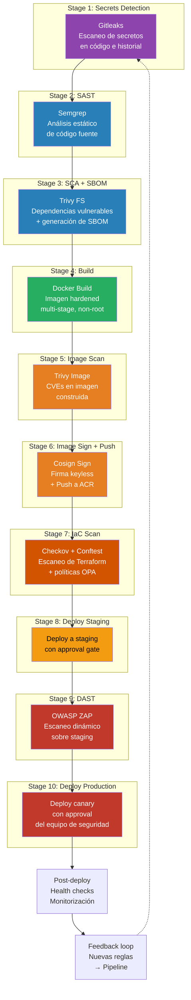
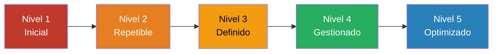

# Cierre — DevSecOps Pipelines Workshop

<div class="lab-meta">
  <div class="lab-meta-item">
    <strong>Sección</strong>
    Cierre y próximos pasos
  </div>
  <div class="lab-meta-item">
    <strong>Audiencia</strong>
    Equipo de Seguridad
  </div>
</div>

---

## Recapitulación: 11 Conceptos + 11 Labs

A lo largo de este workshop, hemos construido un pipeline DevSecOps completo, capa por capa. Cada concepto aporta un control de seguridad específico, y cada lab demuestra su implementación práctica.

### Mapa completo del workshop

| # | Concepto | Control de seguridad | Lab | Herramienta |
|---|---|---|---|---|
| 1 | CI/CD y Seguridad | Integración de seguridad en pipelines | Proyecto GitHub Actions | GitHub Actions |
| 2 | Anatomía del Pipeline | Estructura de stages y gates | Pipeline Base | GitHub Actions YAML |
| 3 | Secretos en Código | Prevención de filtraciones de credenciales | Detección de Secretos | Gitleaks |
| 4 | Análisis Estático (SAST) | Detección de vulnerabilidades en código fuente | SAST con Semgrep | Semgrep |
| 5 | Cadena de Suministro (SCA) | Control de dependencias vulnerables + SBOM | SCA y SBOM | Trivy |
| 6 | Artefactos e Inmutabilidad | Integridad y trazabilidad de artefactos | Build e Imagen | Docker + GHCR |
| 7 | Registros y Confianza | Firma y verificación de imágenes | Escaneo y Firma | Cosign + Trivy |
| 8 | Pruebas Dinámicas (DAST) | Testing de seguridad en aplicación desplegada | DAST con OWASP ZAP | ZAP |
| 9 | IaC y Seguridad | Escaneo de infraestructura como código | Escaneo de IaC | Checkov + OPA |
| 10 | Despliegues Seguros | Approval gates, rollback, separación de deberes | Deploy con Aprobaciones | GitHub Environments |
| 11 | Monitorización | Detección en runtime, feedback loop | Monitorización Post-Deploy | Azure Monitor |

---

## El Pipeline Completo: 10 Stages

Este es el pipeline DevSecOps completo que hemos construido durante el workshop, con todos los controles de seguridad integrados:



### Resumen YAML del pipeline completo

```yaml
# .github/workflows/devsecops.yml — Pipeline DevSecOps completo
trigger:
  branches:
    include: [main]

pool:
  vmImage: 'ubuntu-latest'

stages:
  # ─── Stage 1: Detección de Secretos ──────
  # job: SecretsDetection
    name: '🔑 Secrets Detection'
    jobs:
      - job: Gitleaks
        steps:
          - run: gitleaks detect --source . --report-format sarif --report-path gitleaks.sarif

  # ─── Stage 2: SAST ──────────────────────
  # job: SAST
    name: '🔍 SAST'
    dependsOn: SecretsDetection
    jobs:
      - job: Semgrep
        steps:
          - run: semgrep scan --config auto --sarif --output semgrep.sarif

  # ─── Stage 3: SCA + SBOM ────────────────
  # job: SCA
    name: '📦 SCA + SBOM'
    dependsOn: SecretsDetection
    jobs:
      - job: TrivyFS
        steps:
          - run: trivy fs --scanners vuln --format sarif --output trivy-sca.sarif .
          - run: trivy fs --format spdx-json --output sbom.spdx.json .

  # ─── Stage 4: Build ─────────────────────
  # job: Build
    name: '🏗️ Build'
    dependsOn: [SAST, SCA]
    jobs:
      - job: DockerBuild
        steps:
          - run: docker build -t $(ACR)/$(IMAGE):$(TAG) .

  # ─── Stage 5: Image Scan ────────────────
  # job: ImageScan
    name: '🔬 Image Scan'
    dependsOn: Build
    jobs:
      - job: TrivyImage
        steps:
          - run: trivy image --severity HIGH,CRITICAL --exit-code 1 $(ACR)/$(IMAGE):$(TAG)

  # ─── Stage 6: Sign + Push ───────────────
  # job: SignAndPush
    name: '✍️ Sign + Push'
    dependsOn: ImageScan
    jobs:
      - job: CosignSign
        steps:
          - run: docker push $(ACR)/$(IMAGE):$(TAG)
          - run: cosign sign --yes $(ACR)/$(IMAGE):$(TAG)

  # ─── Stage 7: IaC Scan ──────────────────
  # job: IaCScan
    name: '🏗️ IaC Scan'
    dependsOn: SignAndPush
    jobs:
      - job: Checkov
        steps:
          - run: checkov -d ./infrastructure/ --hard-fail-on HIGH,CRITICAL
          - run: conftest test --policy policy/ tfplan.json

  # ─── Stage 8: Deploy Staging ─────────────
  # job: DeployStaging
    name: '🚀 Deploy Staging'
    dependsOn: IaCScan
    jobs:
      - deployment: Staging
        environment: 'staging'
        strategy:
          runOnce:
            deploy:
              steps:
                - run: echo "Deploy to staging"

  # ─── Stage 9: DAST ──────────────────────
  # job: DAST
    name: '🌐 DAST'
    dependsOn: DeployStaging
    jobs:
      - job: ZAPScan
        steps:
          - run: |
              docker run --rm ghcr.io/zaproxy/zaproxy:stable \
                zap-baseline.py -t https://staging.myapp.com -J zap-report.json

  # ─── Stage 10: Deploy Production ─────────
  # job: DeployProduction
    name: '🎯 Deploy Production'
    dependsOn: DAST
    jobs:
      - deployment: Production
        environment: 'production'  # Requiere approval del equipo de seguridad
        strategy:
          canary:
            increments: [10, 50]
            deploy:
              steps:
                - run: echo "Canary deployment to production"
```

---

## Modelo de Madurez DevSecOps

La adopción de DevSecOps no es binaria. Es un viaje que se recorre incrementalmente. Este modelo te ayuda a evaluar dónde estás y hacia dónde avanzar.

### Niveles de madurez



| Nivel | Nombre | Características | Controles típicos |
|---|---|---|---|
| **1** | **Inicial** | Sin pipeline de seguridad. Escaneos manuales esporádicos. Seguridad como evento puntual. | Pentesting anual, revisiones manuales de código |
| **2** | **Repetible** | Algunos escaneos automáticos pero no obligatorios. Pipeline existe pero no bloquea. | SAST opcional, dependency check manual |
| **3** | **Definido** | Pipeline de seguridad definido y documentado. Scans obligatorios que bloquean el pipeline. | SAST + SCA + secrets en pipeline, image scanning |
| **4** | **Gestionado** | Métricas de seguridad tracked. Políticas como código. Feedback loop activo. | Policy as Code (OPA), firma de imágenes, DAST automático, dashboards |
| **5** | **Optimizado** | Mejora continua basada en datos. Seguridad como enabler, no como bloqueador. Auto-remediación. | ML para detección, auto-remediation, threat modeling continuo, chaos security |

### Autoevaluación rápida

| Pregunta | Sí (2 pts) | Parcial (1 pt) | No (0 pts) |
|---|---|---|---|
| ¿Tienes pipeline CI/CD para todas las apps? | | | |
| ¿Se ejecutan escaneos de seguridad en cada build? | | | |
| ¿Los escaneos bloquean el pipeline si fallan? | | | |
| ¿Las imágenes de contenedor se firman? | | | |
| ¿Existe separación de deberes en despliegues? | | | |
| ¿Tienes Policy as Code (OPA/Checkov)? | | | |
| ¿Se ejecuta DAST en staging automáticamente? | | | |
| ¿Monitorizas eventos de seguridad en producción? | | | |
| ¿Los hallazgos en producción generan nuevas reglas en el pipeline? | | | |
| ¿Puedes demostrar compliance con logs de auditoría del pipeline? | | | |

**Puntuación:**

- **0-6**: Nivel 1-2 — Priorizar establecer un pipeline base con SAST y SCA
- **7-12**: Nivel 2-3 — Fortalecer gates obligatorios y agregar firma de imágenes
- **13-16**: Nivel 3-4 — Implementar Policy as Code y feedback loop
- **17-20**: Nivel 4-5 — Optimizar con métricas, auto-remediación y threat modeling continuo

---

## Recomendaciones para implementar DevSecOps en tu organización

### Fase 1: Fundamentos (Semanas 1-4)

!!! tip "Quick wins de alto impacto"
    1. **Detección de secretos** en pre-commit hooks y CI — impacto inmediato con esfuerzo mínimo
    2. **SAST básico** con Semgrep usando reglas por defecto — detecta los problemas más obvios
    3. **Dependency scanning** con Trivy FS — visibilidad inmediata de CVEs en dependencias
    4. **Branch policies** — requerir al menos 1 reviewer en PRs a main

### Fase 2: Hardening (Semanas 5-8)

- Agregar **escaneo de imágenes** de contenedores
- Implementar **firma de imágenes** con Cosign keyless
- Configurar **GitHub Actions Environments** con approval gates para producción
- Establecer **umbrales de bloqueo**: qué severidades bloquean el pipeline

### Fase 3: Políticas (Semanas 9-12)

- Implementar **Policy as Code** con Checkov y/o OPA para IaC
- Agregar **DAST automático** en staging con ZAP baseline
- Configurar **required templates** para que todos los pipelines usen el template de seguridad
- Crear **dashboards de seguridad** para visibilidad del equipo de seguridad

### Fase 4: Madurez (Mes 4+)

- Implementar **feedback loop** completo: monitorización → nuevas reglas → mejor pipeline
- Agregar **drift detection** programado para infraestructura
- Integrar con **Microsoft Sentinel** para correlación de eventos de seguridad
- Establecer **métricas de seguridad**: MTTD (Mean Time to Detect), MTTR (Mean Time to Remediate)
- **Threat modeling** como parte del proceso de diseño

### Errores comunes a evitar

!!! danger "Anti-patrones que hemos visto en la industria"
    | Anti-patrón | Por qué es un problema | Alternativa |
    |---|---|---|
    | Implementar todo a la vez | Overwhelm al equipo, resistencia al cambio | Incremental, quick wins primero |
    | Pipeline que nunca bloquea | "Security theater" — los escaneos existen pero no tienen dientes | Definir umbrales claros desde el inicio |
    | Ignorar falsos positivos | Fatiga de alertas, el equipo deja de mirar resultados | Tuning continuo de reglas, suppressions documentadas |
    | Seguridad como bloqueador | Developers ven a seguridad como enemigo, buscan workarounds | Seguridad como enabler con tiempos de respuesta rápidos |
    | Solo shift-left | Ignoras lo que pasa en producción | Shift-left AND shift-right |
    | Un solo tool para todo | Ninguna herramienta cubre todo | Stack complementario: SAST + SCA + DAST + IaC scan |

---

## Métricas DevSecOps

Las métricas te permiten demostrar el valor del programa DevSecOps y tomar decisiones basadas en datos.

| Métrica | Qué mide | Objetivo |
|---|---|---|
| **MTTD** (Mean Time to Detect) | Tiempo desde que aparece una vulnerabilidad hasta que se detecta | < 24 horas |
| **MTTR** (Mean Time to Remediate) | Tiempo desde detección hasta remediación | Crítico: < 48h, Alto: < 1 semana |
| **Defect Escape Rate** | % de vulnerabilidades que llegan a producción | < 5% |
| **Pipeline Pass Rate** | % de builds que pasan todos los security gates | > 85% (indica buen tuning de reglas) |
| **Scan Coverage** | % de repositorios con pipeline de seguridad activo | 100% para producción |
| **Mean Age of Vulnerabilities** | Edad promedio de vulnerabilidades abiertas | < 30 días |
| **False Positive Rate** | % de hallazgos que son falsos positivos | < 15% |

---

## Certificaciones Recomendadas

Para los miembros del equipo que quieran profundizar en DevSecOps:

| Certificación | Organismo | Enfoque | Nivel |
|---|---|---|---|
| **CDP** (Certified DevSecOps Professional) | Practical DevSecOps | Hands-on pipeline security | Intermedio |
| **CDE** (Certified DevSecOps Expert) | Practical DevSecOps | Avanzado, policy as code, threat modeling | Avanzado |
| **CASE** (Certified Application Security Engineer) | EC-Council | Seguridad de aplicaciones | Intermedio |
| **CCSK** (Certificate of Cloud Security Knowledge) | CSA | Seguridad cloud | Fundamentos |
| **AZ-500** (Azure Security Engineer Associate) | Microsoft | Seguridad en Azure | Intermedio |
| **AZ-400** (GitHub Actions Engineer Expert) | Microsoft | DevOps en Azure | Avanzado |
| **OSCP** (Offensive Security Certified Professional) | OffSec | Pentesting hands-on | Avanzado |
| **CKS** (Certified Kubernetes Security Specialist) | CNCF | Seguridad de Kubernetes | Avanzado |

---

## Recursos adicionales

### Documentación oficial

- [OWASP DevSecOps Guideline](https://owasp.org/www-project-devsecops-guideline/)
- [NIST SP 800-218 — Secure Software Development Framework](https://csrc.nist.gov/publications/detail/sp/800-218/final)
- [SLSA Framework — Supply-chain Levels for Software Artifacts](https://slsa.dev/)
- [Sigstore Documentation](https://docs.sigstore.dev/)
- [GitHub Actions Security Best Practices](https://learn.microsoft.com/en-us/azure/devops/organizations/security/)

### Herramientas cubiertas en el workshop

| Herramienta | URL | Propósito |
|---|---|---|
| Gitleaks | [github.com/gitleaks/gitleaks](https://github.com/gitleaks/gitleaks) | Detección de secretos |
| Semgrep | [semgrep.dev](https://semgrep.dev) | SAST |
| Trivy | [trivy.dev](https://trivy.dev) | SCA, Image scan, IaC scan |
| Cosign | [github.com/sigstore/cosign](https://github.com/sigstore/cosign) | Firma de imágenes |
| OWASP ZAP | [zaproxy.org](https://www.zaproxy.org) | DAST |
| Checkov | [checkov.io](https://www.checkov.io) | IaC scanning |
| OPA/Conftest | [openpolicyagent.org](https://www.openpolicyagent.org) | Policy as Code |

---

## Contacto Entelgy

Este workshop fue creado e impartido por **Entelgy**, consultora europea especializada en transformación digital, ciberseguridad y entrega cloud-native.

<div class="grid cards" markdown>

- :material-web: **Web**

    [www.entelgy.com](https://www.entelgy.com)

- :material-linkedin: **LinkedIn**

    [linkedin.com/company/entelgy](https://www.linkedin.com/company/entelgy)

- :material-email: **Contacto**

    [workshops@entelgy.com](mailto:workshops@entelgy.com)

</div>

### ¿Interesado en más workshops?

Entelgy ofrece workshops especializados en:

- **DevSecOps avanzado**: Threat modeling, chaos security, auto-remediation
- **Cloud Security Posture Management**: Azure, AWS, multi-cloud
- **Kubernetes Security**: CKS preparation, runtime security, service mesh
- **Offensive Security**: Red team, pentesting de aplicaciones cloud-native
- **Security Champions Program**: Formación para embajadores de seguridad en equipos de desarrollo

!!! abstract "Gracias por participar"
    La seguridad no es un destino, es un viaje. Hoy has dado un paso importante al integrar controles de seguridad automatizados en tu pipeline. El siguiente paso es implementarlo en tu organización, medir resultados, y mejorar continuamente. **La seguridad no es una fase — es el pipeline completo.**

---

<div style="display: flex; justify-content: space-between; margin-top: 2rem;">
  <a href="../lab11-monitorizacion/" class="md-button">:material-arrow-left: Lab 11 — Monitorización Post-Despliegue</a>
  <a href="../limpieza/" class="md-button md-button--primary">Limpieza de recursos :material-arrow-right:</a>
</div>
