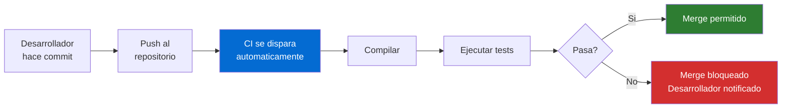
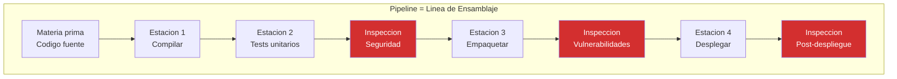
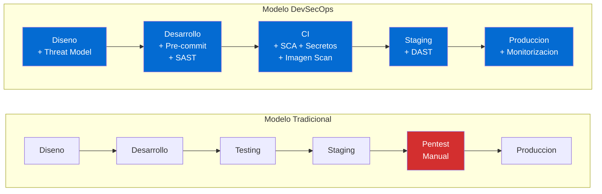
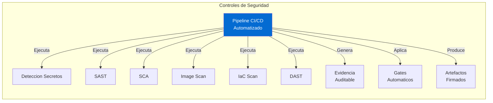
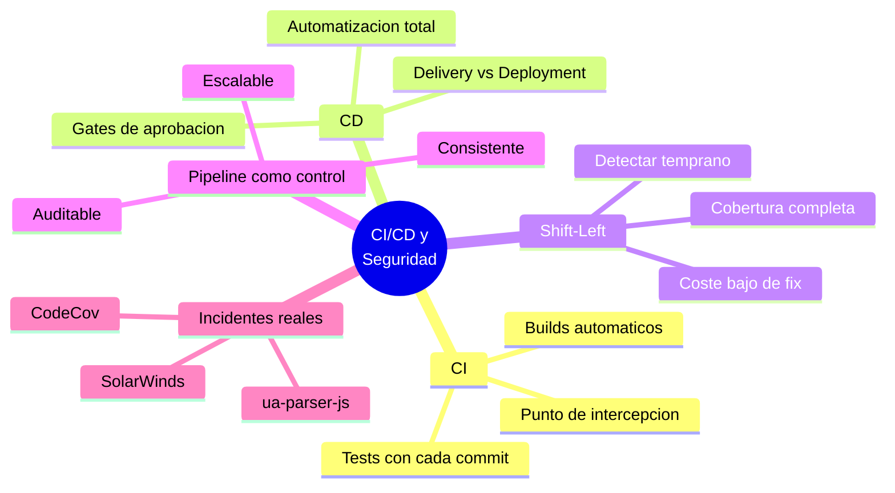

# Concepto 1 — Que es CI/CD y por que deberia importarle a seguridad

## Objetivo de aprendizaje

Al terminar este modulo entenderas que es CI/CD, como funciona un pipeline
como linea de ensamblaje, que significa "shift-left" para un equipo de seguridad
y por que el pipeline es el control de seguridad mas poderoso de una
organizacion moderna.

---

## Que es CI (Integracion Continua)

**Integracion Continua** es la practica de fusionar cambios de codigo en un
repositorio compartido multiples veces al dia, ejecutando automaticamente
compilaciones y pruebas con cada cambio.

Desde la perspectiva de seguridad, CI significa:

- Cada cambio de codigo es **verificable** y **auditable**
- Cada push genera un registro permanente (commit hash, autor, timestamp)
- Las pruebas automaticas actuan como **controles preventivos**
- Los fallos son detectados en minutos, no en semanas

!!! info "CI como control detectivo"
    Para seguridad, CI no es solo "compilar y testear". Es un **punto de
    intercepcion automatico** donde puedes insertar controles de seguridad
    que se ejecutan con cada cambio, sin friccion manual.

---

## Que es CD (Entrega/Despliegue Continuo)

**CD** tiene dos significados relacionados:

| Termino | Definicion | Intervencion humana |
|---------|------------|---------------------|
| **Continuous Delivery** (Entrega Continua) | El codigo siempre esta en estado desplegable; el despliegue a produccion requiere aprobacion manual | Si — aprobacion |
| **Continuous Deployment** (Despliegue Continuo) | Cada cambio que pasa todas las pruebas se despliega automaticamente a produccion | No — totalmente automatico |

!!! warning "Para equipos de seguridad"
    En Continuous Deployment, **no hay revision humana** antes de produccion.
    Esto significa que los controles automatizados en el pipeline son la
    **unica barrera** entre un commit vulnerable y los usuarios finales.
    Si el pipeline no tiene gates de seguridad, el codigo vulnerable llega
    directo a produccion.

---

## El pipeline como linea de ensamblaje

Piensa en el pipeline como una **fabrica con estaciones de inspeccion**:

En una fabrica fisica, las estaciones de inspeccion de calidad estan
**integradas en la linea** — no en un edificio separado al que se envia el
producto terminado una vez al ano. DevSecOps aplica el mismo principio al
software.

---

## Shift-Left: que significa para un equipo de seguridad

"Shift-left" es mover los controles de seguridad **lo mas temprano posible**
en el ciclo de vida del software.

| Aspecto | Modelo Tradicional | Modelo DevSecOps |
|---------|-------------------|------------------|
| **Cuando se detectan vulnerabilidades** | Semanas/meses despues de escribir el codigo | Minutos/horas despues del commit |
| **Coste de remediacion** | Alto (codigo en produccion, dependencias) | Bajo (el desarrollador aun tiene contexto) |
| **Frecuencia de revision** | 1-2 veces al ano | Con cada commit |
| **Cobertura** | Muestra del codigo | 100% del codigo |
| **Registro de evidencia** | Informes PDF puntuales | Logs continuos y auditables |
| **Escalabilidad** | No escala (depende de personas) | Escala con el pipeline |

!!! tip "Shift-left NO elimina el pentest"
    Shift-left **complementa** las pruebas manuales. El pentest anual sigue
    siendo valioso, pero ya no es la unica linea de defensa. Los controles
    automatizados en el pipeline atrapan el 80% de los problemas comunes,
    liberando al equipo de seguridad para enfocarse en logica de negocio
    y ataques sofisticados.

---

## El pipeline como registro de auditoria

Cada ejecucion de pipeline genera un **registro inmutable** que incluye:

- **Quien**: el autor del commit y quien aprobo el merge
- **Que**: los archivos cambiados (diff)
- **Cuando**: timestamp exacto del commit, build y despliegue
- **Resultado**: paso o fallo de cada stage, con logs detallados
- **Artefactos**: binarios generados, reportes de seguridad, SBOMs
- **Hash**: SHA del commit, digest de la imagen

!!! info "Pipeline como SOC de desarrollo"
    Para un analista de seguridad, los logs de pipeline son tan valiosos como
    los logs de un SIEM. Muestran la cadena completa: quien introdujo el
    cambio, que controles paso (o no), y que artefacto se desplego.

---

## Incidentes reales: cuando el pipeline falla

### SolarWinds (2020)

!!! example "Incidente: SolarWinds Sunburst"
    **Que paso**: Atacantes comprometieron el proceso de build de SolarWinds.
    Inyectaron codigo malicioso en la DLL `SolarWinds.Orion.Core.BusinessLayer`
    durante la compilacion. El binario firmado oficialmente contenía un
    backdoor (SUNBURST) que fue distribuido a ~18,000 clientes, incluyendo
    agencias del gobierno de EE.UU.

    **Leccion para el pipeline**:

    - El proceso de build es un **activo critico** que necesita proteccion
    - Si el atacante controla el pipeline, controla el artefacto
    - La firma digital no garantiza integridad si el build esta comprometido
    - Se necesita **integridad del pipeline** (SLSA, builds reproducibles)

### CodeCov (2021)

!!! example "Incidente: CodeCov Bash Uploader"
    **Que paso**: Atacantes modificaron el script `bash uploader` de CodeCov
    (herramienta de cobertura de codigo) para exfiltrar variables de entorno
    de los pipelines CI de los clientes. Durante 2 meses, cada pipeline que
    ejecutaba el script enviaba **secretos, tokens y credenciales** a un
    servidor controlado por los atacantes.

    **Leccion para el pipeline**:

    - Los scripts de terceros en el pipeline son un **vector de ataque**
    - Las variables de entorno del CI contienen secretos sensibles
    - Verificar la integridad de herramientas externas (checksums, pinning)

### ua-parser-js (2021)

!!! example "Incidente: ua-parser-js supply chain"
    **Que paso**: El paquete npm `ua-parser-js` (con ~8 millones de descargas
    semanales) fue comprometido. Las versiones maliciosas (`0.7.29`, `0.8.0`,
    `1.0.0`) incluian un criptominero y un troyano que robaba credenciales.
    La cuenta del mantenedor fue hackeada.

    **Leccion para el pipeline**:

    - Las dependencias de terceros son una superficie de ataque masiva
    - SCA automatizado en el pipeline habria detectado el cambio anomalo
    - El pinning de versiones y la verificacion de integridad son esenciales

---

## El pipeline es el control de seguridad mas poderoso

!!! danger "La idea clave de este workshop"
    **El pipeline es el control de seguridad mas poderoso que tiene una
    organizacion moderna.** Es el unico punto por el que pasa **todo** el
    codigo antes de llegar a produccion. Si lo instrumentas correctamente,
    tienes visibilidad y control total. Si lo ignoras, es una puerta
    abierta.

Por que el pipeline supera a otros controles:

| Caracteristica | Pipeline CI/CD | Pentest Anual | Revision Manual |
|---------------|---------------|---------------|-----------------|
| **Frecuencia** | Cada commit | 1-2x/ano | Bajo demanda |
| **Cobertura** | 100% cambios | Muestra | Muestra |
| **Consistencia** | Mismas reglas siempre | Depende del tester | Depende del revisor |
| **Velocidad** | Minutos | Semanas | Dias |
| **Escalabilidad** | Infinita | No escala | No escala |
| **Evidencia** | Automatica y continua | Informe puntual | Notas |
| **Coste incremental** | Bajo | Alto | Alto |

---

## Vocabulario clave para este workshop

| Termino | Definicion |
|---------|------------|
| **Pipeline** | Secuencia automatizada de pasos que transforma codigo en un artefacto desplegable |
| **Stage** | Grupo logico de trabajos dentro de un pipeline (ej: Build, Test, Deploy) |
| **Job** | Conjunto de pasos que se ejecutan en un mismo agente |
| **Step** | Accion individual dentro de un job (ej: ejecutar un script) |
| **Trigger** | Evento que inicia el pipeline (ej: push, PR, schedule) |
| **Gate** | Condicion que debe cumplirse para avanzar al siguiente stage |
| **Artifact** | Producto generado por el pipeline (binario, imagen, reporte) |
| **Agent** | Maquina que ejecuta los jobs del pipeline |
| **SARIF** | Static Analysis Results Interchange Format — formato estandar de resultados |
| **SBOM** | Software Bill of Materials — lista de componentes del software |

---

## Resumen

---

[:octicons-arrow-left-24: Anterior: Prerequisitos](../modulo0/prerequisites.md){ .md-button }
[Siguiente: Lab 1 — Proyecto GitHub Actions :octicons-arrow-right-24:](../lab01-setup/index.md){ .md-button .md-button--primary }

