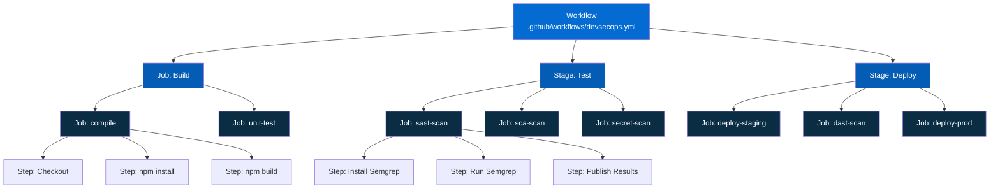
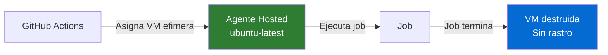
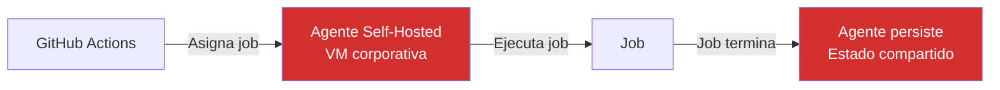
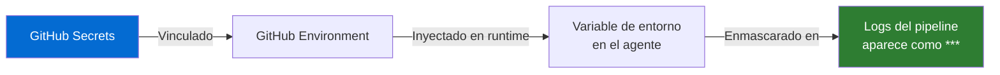
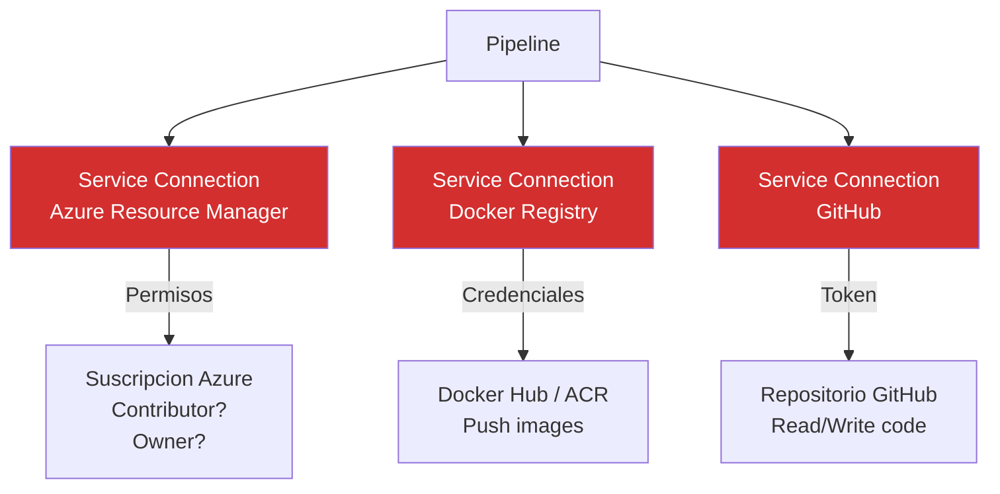
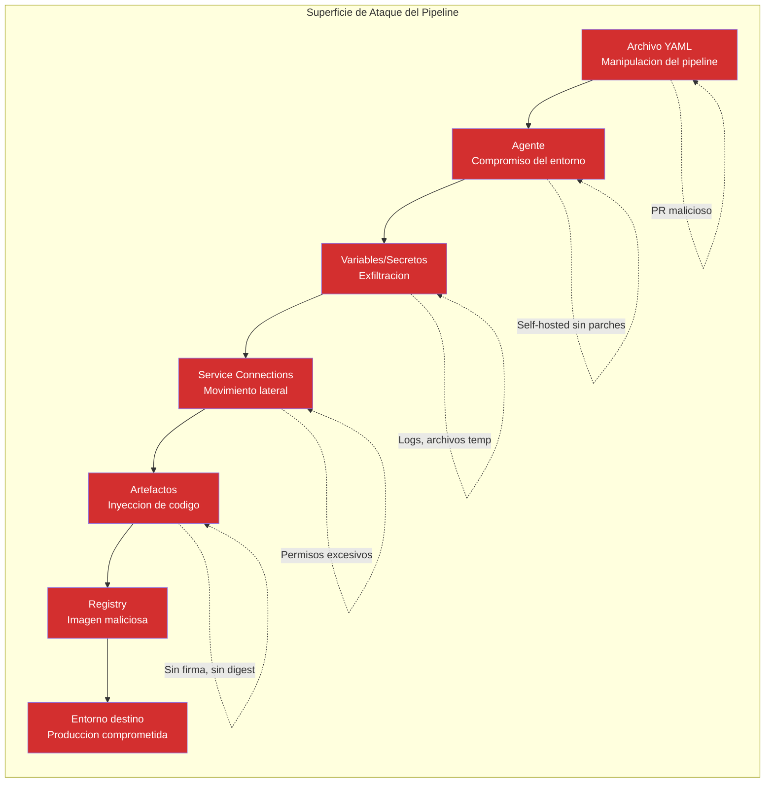
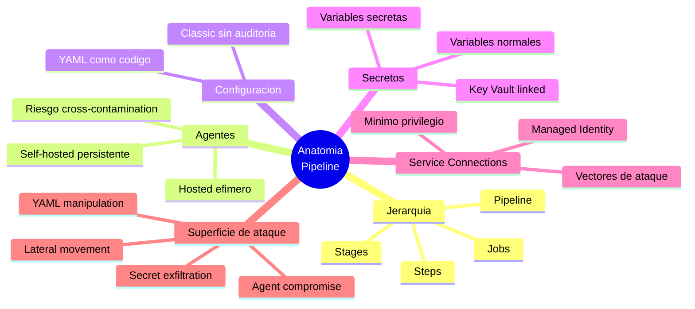

# Concepto 2 — Anatomia del Pipeline

## Objetivo de aprendizaje

Al terminar este modulo entenderas la jerarquia interna de un workflow en
GitHub Actions (Workflow > Jobs > Steps), las diferencias entre runners
hosted y self-hosted desde la perspectiva de seguridad, como YAML define el
pipeline como codigo, y donde se esconden los riesgos en variables, secretos
y permisos del GITHUB_TOKEN.

---

## Jerarquia de GitHub Actions Workflows

Un workflow en GitHub Actions se organiza en una jerarquia:



### Definiciones

| Nivel | Que es | Ejemplo | Implicacion de seguridad |
|-------|--------|---------|--------------------------|
| **Pipeline** | El archivo YAML completo que define todo el flujo | `.github/workflows/devsecops.yml` | Quien puede editarlo controla la seguridad |
| **Stage** | Agrupacion logica con un proposito | `Build`, `Security`, `Deploy` | Las dependencias entre stages crean gates |
| **Job** | Trabajo que se ejecuta en un agente | `sast-scan` | Cada job puede tener permisos diferentes |
| **Step** | Accion atomica dentro de un job | `run: semgrep scan` | Cada step tiene acceso a variables del job |

### Ejemplo YAML basico

```yaml title=".github/workflows/devsecops.yml"
trigger:
  branches:
    include:
      - main

stages:
  # job: Build
    name: "Build"
    jobs:
      - job: compile
        pool:
          vmImage: "ubuntu-latest"
        steps:
          - uses: actions/checkout@v4
          - run: |
              npm ci
              npm run build
            name: "Compilar aplicacion"

  # job: Security
    name: "Security Scans"
    dependsOn: Build
    jobs:
      - job: sast
        pool:
          vmImage: "ubuntu-latest"
        steps:
          - run: |
              pip install semgrep
              semgrep scan --config=auto --sarif -o semgrep.sarif
            name: "SAST con Semgrep"

  # job: Deploy
    name: "Deploy"
    dependsOn: Security
    if: success()
    jobs:
      - deployment: production
        environment: "production"
        strategy:
          runOnce:
            deploy:
              steps:
                - run: echo "Desplegando..."
```

!!! info "La jerarquia es importante para seguridad"
    La relacion `dependsOn` entre stages crea **gates naturales**. Si el
    stage `Security` falla, el stage `Deploy` nunca se ejecuta. Esta es la
    base de "security as a gate" en el pipeline.

---

## Agentes: hosted vs self-hosted

Los **agentes** son las maquinas que ejecutan los jobs. Esta decision tiene
implicaciones criticas de seguridad.

### Agentes hosted (Microsoft-hosted)



| Aspecto | Detalle |
|---------|---------|
| **Ciclo de vida** | VM nueva para cada job, destruida al terminar |
| **Mantenimiento** | Microsoft actualiza SO y herramientas |
| **Red** | IP publica de Microsoft, sin acceso a red interna |
| **Secretos** | Solo existen en memoria durante el job |
| **Ventaja seguridad** | Aislamiento completo entre ejecuciones |
| **Riesgo** | Confias en Microsoft para la integridad del SO |

### Agentes self-hosted



| Aspecto | Detalle |
|---------|---------|
| **Ciclo de vida** | VM persistente, reutilizada entre jobs |
| **Mantenimiento** | Tu equipo parchea y actualiza |
| **Red** | Acceso a red interna corporativa |
| **Secretos** | Pueden persistir en disco entre ejecuciones |
| **Ventaja seguridad** | Control total del entorno |
| **Riesgo** | Cross-contamination entre pipelines, superficie de ataque ampliada |

!!! danger "Riesgo critico: agentes self-hosted compartidos"
    Si multiples proyectos comparten el mismo agente self-hosted, un pipeline
    malicioso puede:

    - Leer secretos residuales de ejecuciones anteriores
    - Modificar herramientas instaladas (supply chain interno)
    - Exfiltrar codigo fuente de otros proyectos
    - Escalar privilegios si el agente corre como root

    **Recomendacion**: usa agentes efimeros (scale-set agents) o contenedores
    aislados para cada job.

---

## YAML vs Classic pipelines

GitHub Actions ofrece dos formas de definir pipelines:

| Caracteristica | YAML (recomendado) | Classic (UI) |
|---------------|-------------------|--------------|
| **Definicion** | Archivo en el repositorio | Configuracion en la UI |
| **Versionado** | Si — control de cambios con Git | No — sin historial |
| **Code Review** | Si — pull requests | No — cambios directos |
| **Auditoria** | Completa (quien cambio que, cuando) | Limitada |
| **Portabilidad** | Si — copiar entre proyectos | No |
| **Seguridad** | Pipeline-as-code = infraestructura auditable | Configuracion opaca |

!!! warning "Classic pipelines son un riesgo de auditoria"
    En pipelines Classic, cualquier persona con permisos de edicion puede
    cambiar el pipeline sin dejar rastro auditable. No hay pull requests,
    no hay revisiones, no hay historial de cambios. Para un equipo de
    seguridad, esto es inaceptable en entornos regulados.

---

## Variables y secretos

### Variables normales

Las variables son pares clave-valor accesibles durante la ejecucion:

```yaml
variables:
  appName: "vulnerable-app"
  buildConfiguration: "Release"
  SEMGREP_RULES: "auto"
```

!!! info "Las variables normales son visibles en logs"
    Cualquier persona con acceso a los logs del pipeline puede ver el valor
    de las variables normales. **Nunca** pongas informacion sensible en
    variables normales.

### Secretos (variables secretas)

Los secretos se almacenan cifrados y se enmascaran en los logs:

```yaml
variables:
  - group: security-secrets  # Variable group vinculado a Key Vault
  # O variable secreta individual:
  - name: DOCKER_PASSWORD
    value: $(dockerPassword)  # Referencia a secreto
```

**Como funcionan internamente:**



| Tipo | Visible en logs | Editable en YAML | Persistencia |
|------|----------------|-----------------|--------------|
| Variable normal | Si | Si | Texto plano en repo |
| Variable secreta (pipeline) | No (enmascarada) | Solo referencia | Cifrada en GitHub Actions |
| Variable group | Depende del tipo | Solo referencia | Cifrada, centralizada |
| Key Vault linked | No | Solo referencia | Cifrada en Key Vault |

!!! danger "El enmascaramiento no es perfecto"
    GitHub Actions enmascara el valor exacto del secreto en logs. Pero si un
    script lo codifica en base64, lo invierte, o lo escribe en un archivo
    publicado como artefacto, el enmascaramiento **no lo detecta**. Un
    pipeline malicioso puede exfiltrar secretos de formas creativas.

---

## Service Connections como vectores de ataque

Las **secrets y permisos** son identidades que permiten al pipeline
interactuar con servicios externos (Azure, Docker Hub, AWS, etc.).



### Superficie de ataque de secrets y permisos

| Riesgo | Descripcion | Mitigacion |
|--------|-------------|------------|
| **Permisos excesivos** | SC con Contributor sobre toda la suscripcion | Principio de minimo privilegio; scope por resource group |
| **Sin aprobacion** | Cualquier pipeline puede usar la SC | Habilitar "Pipeline permissions" — aprobar por pipeline |
| **Sin scope** | SC de Docker push a cualquier repositorio del registry | Limitar a repositorios especificos |
| **Credenciales estaticas** | SC usa client secret con expiracion larga | Usar Managed Identity o Workload Identity Federation |
| **Sin rotacion** | Secret de la SC nunca se rota | Politica de rotacion automatica |

!!! warning "Audita tus secrets y permisos"
    Como analista de seguridad, revisa periodicamente:

    1. Que secrets y permisos existen en cada proyecto
    2. Que permisos tienen sobre los recursos destino
    3. Que pipelines tienen autorizacion para usarlas
    4. Si usan credenciales estaticas o identidades gestionadas
    5. Cuando fue la ultima rotacion de credenciales

---

## Mapa de superficie de ataque del pipeline



### Tabla resumen de vectores

| Vector | Ataque | Impacto | Control |
|--------|--------|---------|---------|
| **Archivo YAML** | PR malicioso modifica el pipeline | Ejecutar codigo arbitrario en CI | Branch protection + CODEOWNERS en el YAML |
| **Triggers** | Fork PR ejecuta pipeline con secretos | Exfiltracion de credenciales | No exponer secretos en PRs de forks |
| **Agentes** | Agente self-hosted comprometido | Acceso a red interna, secretos residuales | Agentes efimeros, aislamiento |
| **Variables** | Secreto expuesto en logs o artefactos | Credenciales comprometidas | Key Vault, enmascaramiento, auditoria |
| **Service Connections** | SC con exceso de privilegios | Movimiento lateral a Azure/cloud | Minimo privilegio, Managed Identity |
| **Marketplace Tasks** | Extension maliciosa del marketplace | Codigo arbitrario en todos los pipelines | Auditar extensiones, whitelist |
| **Artefactos** | Artefacto sin verificar desplegado | Codigo malicioso en produccion | Firma, digest pinning, SLSA |

---

## Permisos y roles en GitHub Actions

| Rol | Puede editar pipeline? | Puede aprobar deploy? | Puede gestionar SC? |
|-----|----------------------|---------------------|--------------------|
| **Reader** | No | No | No |
| **Contributor** | Si | Si (si esta en approvers) | No |
| **Build Administrator** | Si | Si | Si (limitado) |
| **Project Administrator** | Si | Si | Si |
| **Security** (custom) | Lectura + auditoria | Si | Lectura |

!!! tip "Rol recomendado para equipos de seguridad"
    Crea un rol personalizado que tenga:

    - **Lectura** de todos los pipelines y logs
    - **Aprobacion** en los environments de staging y produccion
    - **Lectura** de secrets y permisos y GitHub Environments
    - **Sin edicion** de pipelines (para mantener separacion de funciones)

---

## Resumen



---

<div style="display: flex; justify-content: space-between; margin-top: 2rem;">
[:octicons-arrow-left-24: Anterior: Lab 1](../lab01-setup/index.md){ .md-button }
[Siguiente: Lab 2 — Pipeline Base :octicons-arrow-right-24:](../lab02-pipeline-base/index.md){ .md-button .md-button--primary }
</div>
