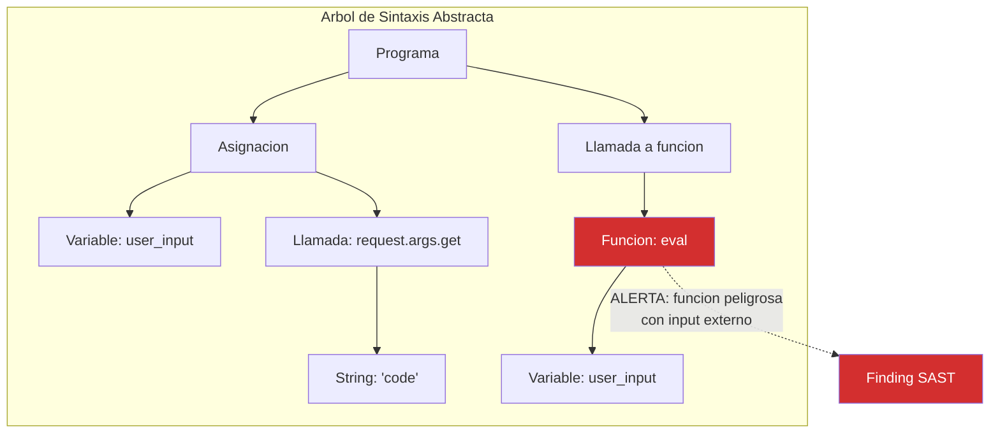
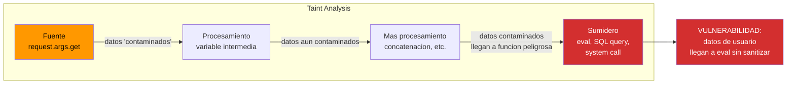
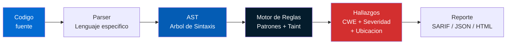
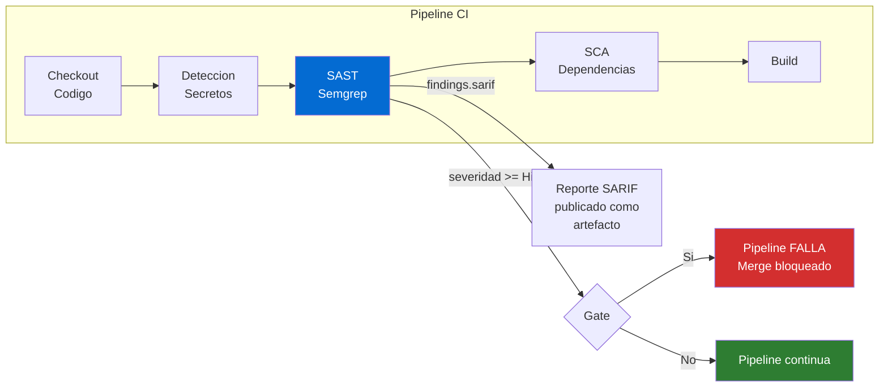
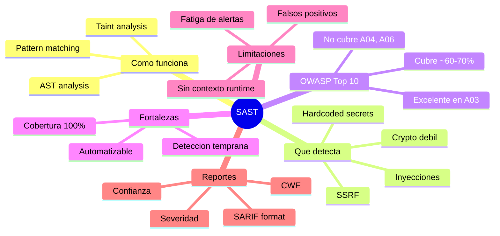

# Concepto 4 — Analisis Estatico (SAST)

## Objetivo de aprendizaje

Al terminar este modulo entenderas que es SAST, como funcionan internamente
las herramientas de analisis estatico (pattern matching, ASTs, taint analysis),
como se mapea al OWASP Top 10, las fortalezas y limitaciones del enfoque, y
como leer e interpretar un reporte SAST como analista de seguridad.

---

## Que es SAST

**SAST** (Static Application Security Testing) es el analisis de codigo fuente
**sin ejecutarlo** para encontrar vulnerabilidades de seguridad.

| Caracteristica | Detalle |
|---------------|---------|
| **Cuando se ejecuta** | En CI, antes de compilar o desplegar |
| **Que analiza** | Codigo fuente, configuraciones, IaC |
| **Como funciona** | Reglas, patrones, arboles de sintaxis |
| **Que NO hace** | No ejecuta la aplicacion, no prueba en runtime |
| **Analogia** | Revisar los planos de un edificio buscando fallos estructurales, sin entrar al edificio |

!!! info "SAST para equipos de seguridad"
    No necesitas saber programar para interpretar resultados SAST. Necesitas
    entender las categorias de vulnerabilidades (CWE), evaluar severidad y
    decidir si un hallazgo es un verdadero positivo o un falso positivo.

---

## Como funciona SAST internamente

Las herramientas SAST usan tres tecnicas principales, de menor a mayor
sofisticacion:

### 1. Pattern Matching (Grep avanzado)

La forma mas simple: buscar patrones de texto que se sabe que son inseguros.

```python
# Patron: uso de eval() con input del usuario
user_input = request.args.get("code")
result = eval(user_input)  # SAST detecta: CWE-95 Eval Injection
```

| Ventaja | Limitacion |
|---------|-----------|
| Rapido y facil de entender | Muchos falsos positivos |
| Facil de escribir reglas custom | No entiende flujo de datos |
| Funciona con cualquier lenguaje | Puede perder variantes |

### 2. AST (Abstract Syntax Tree)

La herramienta parsea el codigo en un arbol de sintaxis y busca patrones
estructurales, no textuales.



| Ventaja | Limitacion |
|---------|-----------|
| Entiende la estructura del codigo | Mas lento que pattern matching |
| Menos falsos positivos | Requiere parser por lenguaje |
| Detecta variantes del mismo patron | No rastrea datos entre funciones |

### 3. Taint Analysis (Analisis de contaminacion)

La tecnica mas avanzada: rastrea el flujo de datos desde **fuentes** (input
del usuario) hasta **sumideros** (funciones peligrosas).



```python
# Taint analysis rastrea el flujo completo:
name = request.form["name"]       # FUENTE: input del usuario (contaminado)
greeting = f"Hello, {name}"       # Propagacion: greeting tambien contaminado
query = f"SELECT * FROM users WHERE name = '{greeting}'"  # Propagacion
cursor.execute(query)             # SUMIDERO: SQL query con datos contaminados
                                  # -> CWE-89 SQL Injection
```

| Ventaja | Limitacion |
|---------|-----------|
| Menor tasa de falsos positivos | Mas lento y complejo |
| Detecta vulnerabilidades reales de flujo | Dificultad con llamadas entre archivos |
| Entiende sanitizacion | Puede perder flujos complejos |

### Diagrama del proceso completo



---

## OWASP Top 10 mapeado a SAST

Que puede detectar SAST del OWASP Top 10 (2021)?

| # | OWASP Top 10 | SAST puede detectar? | CWE comunes | Ejemplo de regla |
|---|-------------|---------------------|-------------|-----------------|
| A01 | Broken Access Control | Parcial | CWE-284, CWE-639 | Endpoint sin decorador de autorizacion |
| A02 | Cryptographic Failures | Si | CWE-327, CWE-328 | Uso de MD5/SHA1, claves hardcodeadas |
| A03 | Injection | Si (excelente) | CWE-89, CWE-79, CWE-78 | SQL injection, XSS, command injection |
| A04 | Insecure Design | No | — | Requiere analisis de logica de negocio |
| A05 | Security Misconfiguration | Parcial | CWE-16 | Debug habilitado, headers inseguros |
| A06 | Vulnerable Components | No (SCA) | — | Lo cubre SCA, no SAST |
| A07 | Auth Failures | Parcial | CWE-287, CWE-798 | Credenciales hardcodeadas |
| A08 | Data Integrity Failures | Parcial | CWE-502 | Deserializacion insegura |
| A09 | Logging Failures | Parcial | CWE-117, CWE-532 | Datos sensibles en logs |
| A10 | SSRF | Si | CWE-918 | URL construida con input de usuario |

!!! info "SAST cubre ~60-70% del OWASP Top 10"
    SAST es excelente para inyecciones (A03), fallos criptograficos (A02) y
    SSRF (A10). Es parcial para access control y configuracion. No puede
    detectar problemas de diseno o componentes vulnerables (eso es SCA).
    Por eso el pipeline necesita **multiples herramientas**, no solo SAST.

---

## Fortalezas y limitaciones de SAST

### Fortalezas

| Fortaleza | Explicacion |
|-----------|-------------|
| **Cobertura completa** | Analiza el 100% del codigo fuente, no una muestra |
| **Deteccion temprana** | Encuentra vulnerabilidades antes de ejecutar la app |
| **Escalable** | Automatizable en CI, escala con el numero de proyectos |
| **Ubicacion exacta** | Senala archivo, linea y fragmento de codigo vulnerable |
| **Consistente** | Mismas reglas, mismos resultados cada vez |
| **Educativo** | Ayuda a desarrolladores a aprender patrones inseguros |

### Limitaciones

| Limitacion | Explicacion |
|-----------|-------------|
| **Falsos positivos** | Reporta codigo seguro como vulnerable (tasa tipica: 30-60%) |
| **Falsos negativos** | No detecta toda vulnerabilidad (logica de negocio, configuracion runtime) |
| **No entiende contexto** | No sabe si un endpoint esta expuesto a internet o es interno |
| **Runtime invisible** | No detecta problemas que solo aparecen en ejecucion |
| **Tiempo de analisis** | Proyectos grandes pueden tardar minutos/horas |
| **Configuracion inicial** | Requiere tuning de reglas para reducir ruido |

!!! warning "El mayor riesgo: fatiga de alertas"
    Si SAST genera cientos de hallazgos, muchos de ellos falsos positivos,
    los equipos empiezan a ignorar los resultados. Es **critico** invertir
    tiempo en configurar reglas, excluir falsos positivos conocidos y
    priorizar por severidad. Un SAST mal configurado es peor que no tener
    SAST — da una falsa sensacion de seguridad.

---

## Como leer un reporte SAST

Un hallazgo SAST tipico tiene estos campos:

### Estructura de un finding

| Campo | Descripcion | Ejemplo |
|-------|-------------|---------|
| **Rule ID** | Identificador de la regla que se violo | `python.flask.sql-injection` |
| **CWE** | Common Weakness Enumeration — categoria estandar | CWE-89 (SQL Injection) |
| **Severidad** | Impacto potencial si se explota | Critical / High / Medium / Low |
| **Confianza** | Certeza de la herramienta de que es un verdadero positivo | High / Medium / Low |
| **Archivo** | Ruta del archivo con el codigo vulnerable | `app/routes/users.py` |
| **Linea** | Numero de linea donde esta el problema | Linea 42 |
| **Fragmento** | Codigo fuente relevante | `cursor.execute(f"SELECT...")` |
| **Descripcion** | Explicacion del problema | "User input flows into SQL query..." |
| **Remediacion** | Como arreglar el problema | "Use parameterized queries" |

### Ejemplo de finding (Semgrep SARIF)

```json
{
  "ruleId": "python.flask.security.injection.sql-injection",
  "level": "error",
  "message": {
    "text": "User-controlled data from 'request.args' is used in a SQL query without parameterization. This could allow SQL injection."
  },
  "locations": [{
    "physicalLocation": {
      "artifactLocation": { "uri": "app/routes/users.py" },
      "region": { "startLine": 42, "startColumn": 5 }
    }
  }],
  "properties": {
    "cwe": ["CWE-89"],
    "confidence": "HIGH",
    "severity": "ERROR"
  }
}
```

### Matriz de priorizacion

| Severidad + Confianza | Accion recomendada | SLA sugerido |
|-----------------------|--------------------|----|
| Critical + High confidence | Bloquear pipeline, arreglar inmediatamente | 24 horas |
| High + High confidence | Bloquear pipeline, arreglar antes de merge | 48 horas |
| High + Medium confidence | Revisar manualmente, probablemente real | 1 semana |
| Medium + High confidence | Arreglar en el sprint actual | 2 semanas |
| Medium + Medium/Low confidence | Evaluar en backlog | 1 mes |
| Low + cualquier confianza | Registrar, revisar periodicamente | Backlog |

!!! tip "El equipo de seguridad define la politica de gates"
    Como analista de seguridad, tu decides:

    - Que severidades bloquean el pipeline (ej: Critical y High)
    - Que CWEs son criticos para tu organizacion
    - Cuanto tiempo tienen los equipos para remediar
    - Que excepciones son aceptables y como se documentan

---

## Herramientas SAST comunes

| Herramienta | Lenguajes | Licencia | Enfoque |
|-------------|-----------|----------|---------|
| **Semgrep** | 30+ lenguajes | Community (gratis) + Pro | Reglas pattern + taint, excelente DX |
| **SonarQube** | 30+ lenguajes | Community (gratis) + Enterprise | Calidad + seguridad, dashboard |
| **CodeQL** | 10+ lenguajes | Gratis para open source | Queries como codigo, muy potente |
| **Bandit** | Python | Gratis | Especializado en Python |
| **ESLint (security)** | JavaScript/TS | Gratis | Plugins de seguridad para JS |
| **Checkmarx** | 25+ lenguajes | Comercial | Enterprise, cumplimiento |
| **Fortify** | 25+ lenguajes | Comercial | Enterprise, gobierno |
| **Snyk Code** | 10+ lenguajes | Freemium | AI-powered, IDE integration |

!!! info "En este workshop usamos Semgrep"
    Semgrep es la herramienta elegida porque:

    - Es gratuita para uso en CI (Community edition)
    - Tiene reglas preconfiguradas de alta calidad
    - Soporta reglas personalizadas con sintaxis intuitiva
    - Genera output SARIF para integracion con GitHub Actions
    - Es rapida (analiza proyectos grandes en segundos)

---

## SAST en el contexto del pipeline



---

## Resumen



---

<div style="display: flex; justify-content: space-between; margin-top: 2rem;">
[:octicons-arrow-left-24: Anterior: Lab 3](../lab03-secretos/index.md){ .md-button }
[Siguiente: Lab 4 — SAST con Semgrep :octicons-arrow-right-24:](../lab04-sast/index.md){ .md-button .md-button--primary }
</div>
