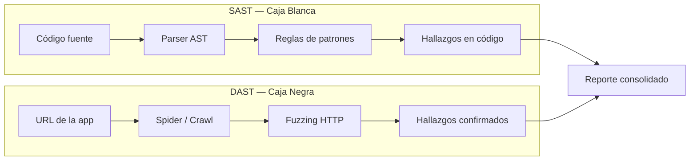
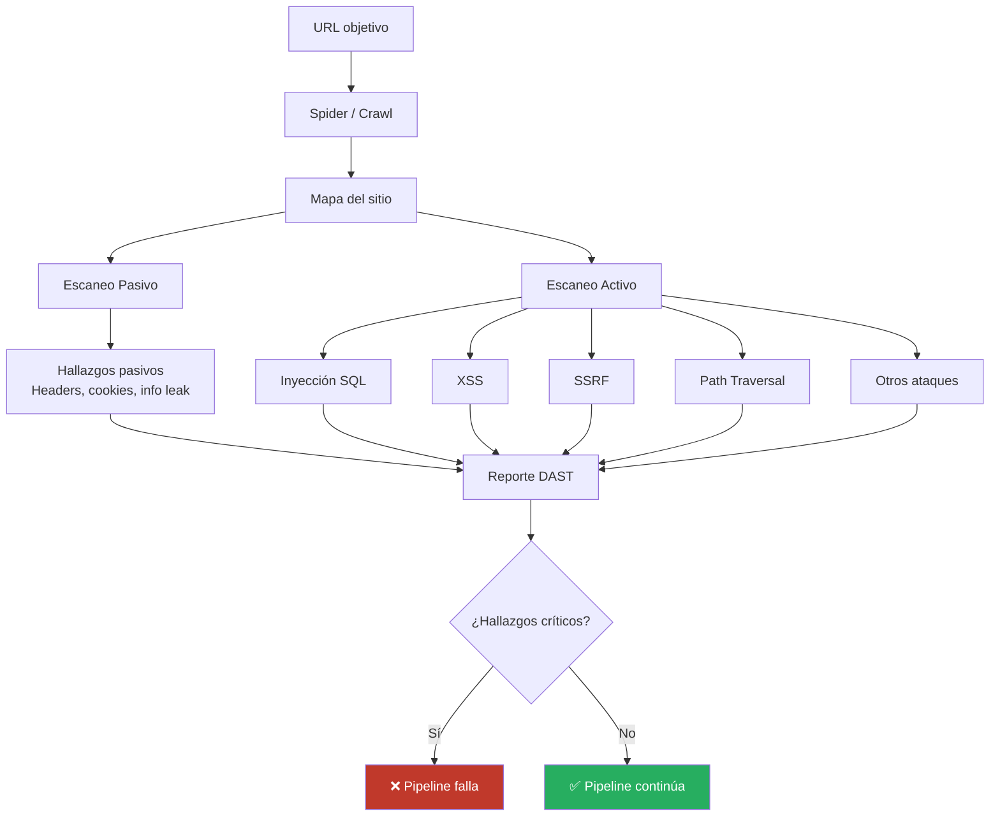
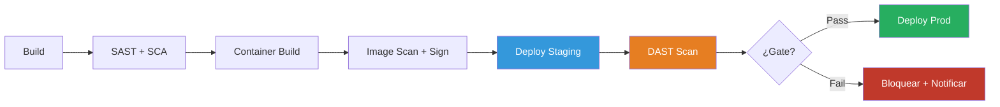
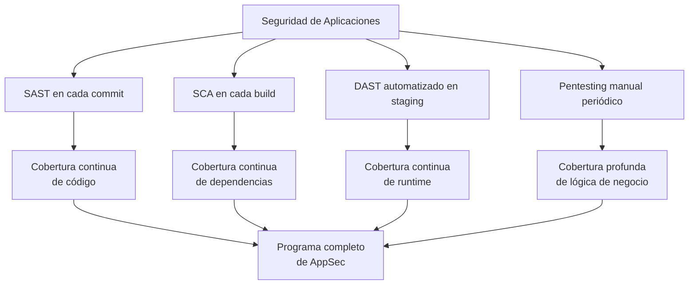

# Concepto 8 — Pruebas Dinámicas de Seguridad (DAST)

<div class="lab-meta">
  <div class="lab-meta-item">
    <strong>Duración estimada</strong>
    20 minutos de lectura
  </div>
  <div class="lab-meta-item">
    <strong>Audiencia</strong>
    Equipo de Seguridad
  </div>
  <div class="lab-meta-item">
    <strong>Relevancia</strong>
    Application Security Testing
  </div>
</div>

---

## ¿Qué es DAST?

**DAST** (Dynamic Application Security Testing) es una técnica de pruebas de seguridad que analiza una aplicación **en ejecución** desde el exterior, sin acceso al código fuente. Actúa como un atacante automatizado: envía peticiones HTTP malformadas, intenta inyecciones, prueba configuraciones erróneas y reporta las vulnerabilidades encontradas.

!!! info "DAST en una frase"
    DAST es un **pentester automatizado** que prueba tu aplicación desplegada tal como la vería un atacante externo.

---

## DAST vs SAST: Diferencias fundamentales

| Aspecto | SAST (Concepto 4) | DAST (este concepto) |
|---|---|---|
| **¿Qué analiza?** | Código fuente / bytecode | Aplicación en ejecución |
| **¿Necesita código?** | Sí | No |
| **¿Necesita app desplegada?** | No | Sí |
| **Perspectiva** | Inside-out (caja blanca) | Outside-in (caja negra) |
| **¿Qué encuentra?** | Bugs en lógica de código, SQL injection en queries, XSS en templates | Misconfigs del servidor, headers faltantes, CORS, auth flaws |
| **Falsos positivos** | Altos (no ve el contexto runtime) | Bajos (confirma explotabilidad real) |
| **Lenguaje** | Específico por lenguaje | Agnóstico — prueba HTTP/HTTPS |
| **Cuándo en el pipeline** | Fase de build (antes de compilar) | Fase de staging (después de desplegar) |
| **Velocidad** | Rápido (segundos a minutos) | Lento (minutos a horas) |
| **Cobertura** | Todo el código accesible | Solo endpoints alcanzables via HTTP |



!!! warning "No son excluyentes — son complementarios"
    SAST y DAST encuentran tipos de vulnerabilidades **diferentes**. Usar solo uno es como revisar solo la mitad del edificio. Un programa de seguridad maduro ejecuta ambos.

---

## Fases de un escaneo DAST

### 1. Spider / Crawl (Descubrimiento)

El escáner primero **descubre la superficie de ataque** navegando por la aplicación como lo haría un usuario:

- Sigue enlaces HTML
- Analiza formularios
- Descubre endpoints de APIs (si se provee OpenAPI spec)
- Identifica parámetros en URLs y cookies
- Mapea la estructura del sitio

### 2. Escaneo Pasivo

Durante el crawl, el escáner analiza **las respuestas** del servidor sin enviar payloads maliciosos:

- Headers de seguridad ausentes (`X-Frame-Options`, `Content-Security-Policy`, `Strict-Transport-Security`)
- Cookies sin flags de seguridad (`Secure`, `HttpOnly`, `SameSite`)
- Información expuesta en respuestas (versiones de servidor, stack traces)
- Configuración TLS/SSL deficiente

### 3. Escaneo Activo

El escáner envía **payloads maliciosos** a cada parámetro descubierto:

- Inyecciones SQL: `' OR 1=1 --`, `UNION SELECT`, etc.
- Cross-Site Scripting (XSS): `<script>alert(1)</script>`, event handlers
- Path Traversal: `../../etc/passwd`
- Server-Side Request Forgery (SSRF): peticiones a metadata endpoints
- Command Injection: `; ls -la`, `| cat /etc/passwd`



### Escaneo Pasivo vs Activo en el Pipeline

| Característica | Pasivo | Activo |
|---|---|---|
| **Riesgo para la app** | Ninguno | Puede causar datos basura, crash |
| **Tiempo** | Segundos a minutos | Minutos a horas |
| **Apto para cada PR** | Sí | No (solo releases / nightly) |
| **Hallazgos** | Configuración, headers | Vulnerabilidades explotables |
| **Recomendación pipeline** | Siempre | En staging, con schedule |

---

## ¿Qué encuentra DAST que SAST no puede?

Esta es la pregunta clave para un equipo de seguridad. DAST detecta problemas que **solo se manifiestan en runtime**:

### 1. Configuraciones erróneas del servidor

| Misconfiguration | Por qué SAST no lo ve | DAST lo detecta |
|---|---|---|
| Headers de seguridad faltantes | No están en el código de la app | Analiza cada respuesta HTTP |
| TLS mal configurado | Configuración del servidor web | Prueba el handshake TLS |
| CORS excesivamente permisivo | Puede estar en config del reverse proxy | Envía peticiones cross-origin |
| Directory listing habilitado | Configuración de Nginx/Apache | Navega directorios |
| Versión del servidor expuesta | Header `Server: Apache/2.4.51` | Lee headers de respuesta |

### 2. Problemas de autenticación y sesión

- Tokens de sesión predecibles
- Cookies sin `Secure` / `HttpOnly`
- Falta de invalidación de sesión al logout
- Bypass de autenticación por manipulación de parámetros

### 3. Vulnerabilidades de lógica de negocio (parcialmente)

- IDOR (Insecure Direct Object Reference) — acceder a recursos de otros usuarios
- Rate limiting ausente en endpoints sensibles
- Falta de validación server-side (client-side bypass)

### 4. Problemas de infraestructura

- Endpoints de debug expuestos (`/debug`, `/actuator`, `/elmah`)
- Archivos sensibles accesibles (`/.env`, `/backup.sql`, `/.git/config`)
- APIs sin autenticación

!!! example "Ejemplo concreto: Header Content-Security-Policy"
    ```
    # ¿Dónde está el problema?
    # No en el código Python/Java/C# — ahí no existe
    # Está en la configuración de Nginx, Apache, o el middleware
    
    # SAST: ❌ No analiza configuración del servidor web
    # DAST: ✅ Detecta la ausencia en cada respuesta HTTP
    ```

---

## DAST en el Pipeline CI/CD

### Posición en el pipeline

DAST **requiere una aplicación desplegada y accesible** por red. Esto lo posiciona necesariamente después del despliegue a un entorno (staging o efímero).



### Estrategias de integración

=== "Escaneo baseline en cada PR"

    ```yaml
    # Solo escaneo pasivo — rápido y seguro
    - run:
      name: 'DAST - Baseline Scan'
      inputs:
        targetType: inline
        script: |
          docker run --rm \
            -v $(Pipeline.Workspace)/reports:/zap/wrk \
            ghcr.io/zaproxy/zaproxy:stable \
            zap-baseline.py \
              -t https://staging.myapp.com \
              -r dast-baseline.html \
              -J dast-baseline.json
    ```

=== "Escaneo completo en release"

    ```yaml
    # Escaneo activo — más lento pero más completo
    - run:
      name: 'DAST - Full Scan'
      inputs:
        targetType: inline
        script: |
          docker run --rm \
            -v $(Pipeline.Workspace)/reports:/zap/wrk \
            ghcr.io/zaproxy/zaproxy:stable \
            zap-full-scan.py \
              -t https://staging.myapp.com \
              -r dast-full.html \
              -J dast-full.json \
              -m 10  # timeout 10 min por URL
    ```

=== "Escaneo de API"

    ```yaml
    # Usa la especificación OpenAPI como guía
    - run:
      name: 'DAST - API Scan'
      inputs:
        targetType: inline
        script: |
          docker run --rm \
            -v $(Pipeline.Workspace)/reports:/zap/wrk \
            ghcr.io/zaproxy/zaproxy:stable \
            zap-api-scan.py \
              -t https://staging.myapp.com/openapi.json \
              -f openapi \
              -r dast-api.html \
              -J dast-api.json
    ```

---

## OWASP ZAP: La herramienta de referencia

**OWASP ZAP** (Zed Attack Proxy) es la herramienta DAST open-source más utilizada. Desde 2023 se mantiene bajo el proyecto **ZAProxy** (anteriormente bajo OWASP directamente).

### Modos de escaneo de ZAP

| Modo | Descripción | Uso en pipeline | Duración típica |
|---|---|---|---|
| `zap-baseline.py` | Solo pasivo + spider | Cada PR | 2-5 minutos |
| `zap-full-scan.py` | Pasivo + activo completo | Release / nightly | 30-120 minutos |
| `zap-api-scan.py` | Especializado para APIs REST/GraphQL | Cada PR (si hay OpenAPI spec) | 5-15 minutos |

### Configuración de umbrales

```
# zap-rules.conf — personalizar qué reglas fallan el pipeline
# Formato: <rule-id>  IGNORE|INFO|WARN|FAIL

10010   IGNORE  # Cookie No HttpOnly Flag (aceptamos en staging)
10011   FAIL    # Cookie Without Secure Flag (no negociable)
10015   FAIL    # Incomplete or No Cache-control Header
10020   FAIL    # X-Frame-Options Header Missing
10021   FAIL    # X-Content-Type-Options Header Missing
10036   WARN    # Server Leaks Version Information
10038   FAIL    # Content Security Policy Header Not Set
40012   FAIL    # Cross Site Scripting (Reflected)
40014   FAIL    # Cross Site Scripting (Persistent)
40018   FAIL    # SQL Injection
90033   FAIL    # Loosely Scoped Cookie
```

---

## Incidentes Reales

!!! example "Caso 1: Capital One (2019) — $80M multa"
    Un SSRF (Server-Side Request Forgery) en una aplicación web de Capital One permitió a un atacante acceder al endpoint de metadata de AWS (`169.254.169.254`), obteniendo credenciales IAM temporales. Con esas credenciales, exfiltró datos de **106 millones de clientes**. Un escaneo DAST habría detectado la vulnerabilidad SSRF. SAST no habría encontrado el problema porque la vulnerabilidad dependía de la configuración del WAF y el entorno de ejecución.

!!! example "Caso 2: Equifax (2017) — 147 millones de registros"
    Aunque la causa raíz fue una dependencia vulnerable (Apache Struts — detectable por SCA), la explotación fue a través de una vulnerabilidad web explotable remotamente. Un escaneo DAST activo habría confirmado la explotabilidad del CVE antes de que el atacante lo hiciera.

!!! example "Caso 3: Uber (2016) — Acceso a datos de 57 millones de usuarios"
    Un bucket S3 público fue descubierto porque contenía credenciales hardcodeadas. Si bien la credencial en código es un hallazgo de SAST/secrets scanning, la misconfiguration del bucket (acceso público) es un hallazgo típico de escaneo de infraestructura que complementa DAST.

---

## DAST NO reemplaza el Pentesting Manual

!!! danger "Limitación crítica"
    DAST automatizado cubre un **subconjunto** de lo que un pentester humano puede encontrar. Un escáner no entiende lógica de negocio, no encadena vulnerabilidades, y no piensa creativamente.

| Capacidad | DAST Automatizado | Pentesting Manual |
|---|---|---|
| Vulnerabilidades técnicas conocidas | Excelente | Excelente |
| Lógica de negocio | Limitado | Excelente |
| Encadenamiento de vulnerabilidades | No | Sí |
| Escalación de privilegios compleja | No | Sí |
| Ingeniería social | No | Sí |
| Cobertura repetible | Sí (cada build) | No (puntual) |
| Coste por ejecución | Bajo | Alto |
| Velocidad | Minutos-horas | Días-semanas |

### La estrategia correcta



---

## Mejores Prácticas para el Equipo de Seguridad

1. **Baseline scan en cada PR** — escaneo pasivo rápido que no bloquea el flujo de desarrollo
2. **Full scan en releases** — escaneo activo antes de producción, con más tiempo y profundidad
3. **API scan si existe OpenAPI spec** — cobertura específica de endpoints de API
4. **Definir reglas de fallo claras** — qué severidades bloquean el pipeline (`zap-rules.conf`)
5. **Entorno dedicado para DAST** — staging aislado para evitar que payloads maliciosos afecten datos reales
6. **Autenticación en el escáner** — configurar ZAP con credenciales para probar áreas autenticadas
7. **Combinar con SAST** — correlacionar hallazgos de ambas herramientas para priorizar mejor
8. **No ignorar hallazgos "informativos"** — headers faltantes son indicadores de postura de seguridad débil

---

## Resumen

| Pregunta | Respuesta |
|---|---|
| ¿Qué es DAST? | Pruebas de seguridad sobre la aplicación en ejecución |
| ¿Cuándo se ejecuta? | Después del despliegue a staging |
| ¿Reemplaza a SAST? | No — son complementarios |
| ¿Reemplaza al pentesting? | No — es una capa continua que complementa el pentesting periódico |
| ¿Herramienta recomendada? | OWASP ZAP (open source, CI/CD ready) |
| ¿Qué detecta que SAST no? | Misconfigs de servidor, headers faltantes, CORS, auth flaws, SSRF |
| ¿Riesgo principal? | El escaneo activo puede generar datos basura en la base de datos |

---

<div style="display: flex; justify-content: space-between; margin-top: 2rem;">
  <a href="../../lab07-image-signing/" class="md-button">:material-arrow-left: Lab 7 — Escaneo y Firma de Imagen</a>
  <a href="../../lab08-dast/" class="md-button md-button--primary">Lab 8 — DAST con OWASP ZAP :material-arrow-right:</a>
</div>
