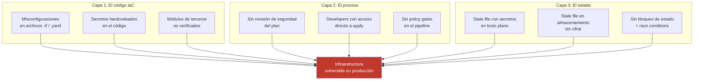
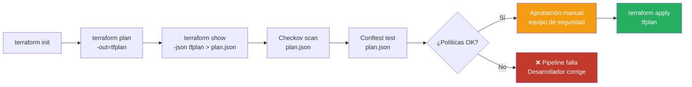
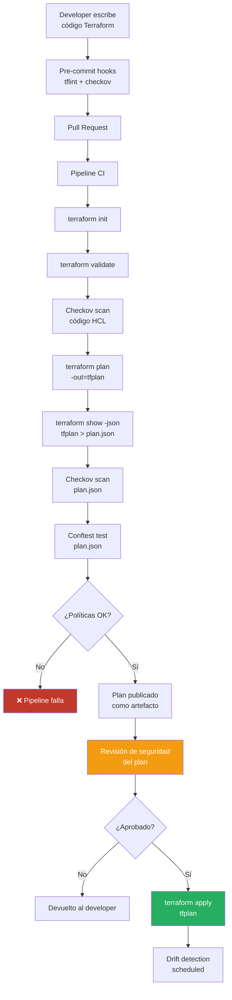

# Concepto 9 — Seguridad en Infraestructura como Código (IaC)

<div class="lab-meta">
  <div class="lab-meta-item">
    <strong>Duración estimada</strong>
    25 minutos de lectura
  </div>
  <div class="lab-meta-item">
    <strong>Audiencia</strong>
    Equipo de Seguridad
  </div>
  <div class="lab-meta-item">
    <strong>Relevancia</strong>
    Cloud Security Posture
  </div>
</div>

---

## ¿Qué es Infraestructura como Código?

**Infraestructura como Código (IaC)** es la práctica de definir y gestionar infraestructura (redes, servidores, bases de datos, políticas de acceso) mediante archivos de configuración declarativos, en lugar de procesos manuales a través de consolas web.

```hcl
# Ejemplo: Un recurso Azure definido como código
resource "azurerm_storage_account" "example" {
  name                     = "stdevsecopsworkshop"
  resource_group_name      = azurerm_resource_group.example.name
  location                 = "westeurope"
  account_tier             = "Standard"
  account_replication_type = "LRS"
  min_tls_version          = "TLS1_2"
  
  blob_properties {
    delete_retention_policy {
      days = 30
    }
  }
}
```

### Herramientas principales de IaC

| Herramienta | Proveedor | Lenguaje | Cloud soportados |
|---|---|---|---|
| **Terraform** | HashiCorp | HCL | Multi-cloud (Azure, AWS, GCP, +1000 providers) |
| **OpenTofu** | Linux Foundation | HCL | Multi-cloud (fork open source de Terraform) |
| **CloudFormation** | AWS | JSON/YAML | Solo AWS |
| **ARM Templates** | Microsoft | JSON | Solo Azure |
| **Bicep** | Microsoft | Bicep (DSL) | Solo Azure |
| **Pulumi** | Pulumi | Python, TypeScript, Go, C# | Multi-cloud |
| **Crossplane** | CNCF | YAML (K8s CRDs) | Multi-cloud |

---

## ¿Por qué IaC es una preocupación de seguridad?

IaC es **código que define tu superficie de ataque**. Una línea mal configurada puede exponer toda tu infraestructura.

!!! danger "La paradoja de IaC"
    IaC existe para hacer la infraestructura **reproducible y auditable**. Pero si el código de IaC contiene errores de seguridad, esos errores también se reproducen y escalan de forma consistente.

### Las tres capas de riesgo



---

## Misconfiguraciones Comunes en IaC

Las misconfiguraciones de IaC son la **causa número uno** de brechas de seguridad en la nube. A continuación, las más frecuentes y peligrosas:

### 1. Almacenamiento público

=== "Terraform (Azure) — INSEGURO"

    ```hcl
    resource "azurerm_storage_account" "bad" {
      name                     = "stpublicdata"
      # ❌ Acceso público habilitado por defecto
      allow_nested_items_to_be_public = true
      # ❌ Sin cifrado personalizado
      # ❌ Sin network rules
      # ❌ TLS 1.0 por defecto en versiones antiguas
    }
    
    resource "azurerm_storage_container" "bad" {
      name                  = "datos-clientes"
      storage_account_name  = azurerm_storage_account.bad.name
      # ❌ Acceso público a blobs
      container_access_type = "blob"
    }
    ```

=== "Terraform (Azure) — SEGURO"

    ```hcl
    resource "azurerm_storage_account" "good" {
      name                          = "stprivatedata"
      allow_nested_items_to_be_public = false
      min_tls_version               = "TLS1_2"
      enable_https_traffic_only     = true
      
      network_rules {
        default_action = "Deny"
        ip_rules       = ["203.0.113.0/24"]  # Solo IPs autorizadas
        virtual_network_subnet_ids = [azurerm_subnet.app.id]
      }
      
      blob_properties {
        delete_retention_policy { days = 30 }
        versioning_enabled = true
      }
    }
    
    resource "azurerm_storage_container" "good" {
      name                  = "datos-clientes"
      storage_account_name  = azurerm_storage_account.good.name
      container_access_type = "private"  # ✅ Sin acceso público
    }
    ```

### 2. Grupos de seguridad de red abiertos

```hcl
# ❌ INSEGURO — Permite SSH desde cualquier IP en Internet
resource "azurerm_network_security_rule" "bad_ssh" {
  name                        = "allow-ssh"
  priority                    = 100
  direction                   = "Inbound"
  access                      = "Allow"
  protocol                    = "Tcp"
  source_port_range           = "*"
  destination_port_range      = "22"
  source_address_prefix       = "*"          # ← TODO Internet
  destination_address_prefix  = "*"
  resource_group_name         = azurerm_resource_group.example.name
  network_security_group_name = azurerm_network_security_group.example.name
}

# ✅ SEGURO — Solo desde la VPN corporativa
resource "azurerm_network_security_rule" "good_ssh" {
  name                        = "allow-ssh-vpn"
  priority                    = 100
  direction                   = "Inbound"
  access                      = "Allow"
  protocol                    = "Tcp"
  source_port_range           = "*"
  destination_port_range      = "22"
  source_address_prefix       = "10.0.100.0/24"  # ← Solo VPN
  destination_address_prefix  = "10.0.1.0/24"
  resource_group_name         = azurerm_resource_group.example.name
  network_security_group_name = azurerm_network_security_group.example.name
}
```

### 3. Sin cifrado en reposo

```hcl
# ❌ Base de datos sin cifrado TDE
resource "azurerm_mssql_database" "bad" {
  name      = "db-clientes"
  server_id = azurerm_mssql_server.example.id
  # transparent_data_encryption NO configurado
}

# ✅ Base de datos con cifrado y CMK
resource "azurerm_mssql_database" "good" {
  name                        = "db-clientes"
  server_id                   = azurerm_mssql_server.example.id
  transparent_data_encryption_key_vault_key_id = azurerm_key_vault_key.tde.id
}
```

### 4. IAM excesivamente permisivo

```hcl
# ❌ Rol de Owner a nivel de suscripción para una app
resource "azurerm_role_assignment" "bad" {
  scope                = data.azurerm_subscription.primary.id
  role_definition_name = "Owner"  # ← Puede hacer TODO
  principal_id         = azurerm_user_assigned_identity.app.principal_id
}

# ✅ Rol mínimo necesario a nivel de resource group
resource "azurerm_role_assignment" "good" {
  scope                = azurerm_resource_group.app.id
  role_definition_name = "Storage Blob Data Reader"  # ← Solo lectura de blobs
  principal_id         = azurerm_user_assigned_identity.app.principal_id
}
```

### Tabla resumen de misconfiguraciones

| Misconfiguración | Riesgo | Severidad | Frecuencia |
|---|---|---|---|
| Storage público | Exfiltración de datos | :material-alert: Crítica | Muy alta |
| NSG abierto (0.0.0.0/0) | Acceso remoto no autorizado | :material-alert: Crítica | Alta |
| Sin cifrado en reposo | Incumplimiento normativo + robo de datos | Alta | Media |
| IAM excesivo | Escalación de privilegios | :material-alert: Crítica | Muy alta |
| Sin logging/auditoría | Imposibilidad de detectar ataques | Alta | Alta |
| Secretos en código HCL | Credential leak | :material-alert: Crítica | Media |
| Base de datos pública | Acceso directo a datos | :material-alert: Crítica | Media |
| Sin backup configurado | Pérdida de datos ante ransomware | Alta | Alta |

!!! warning "Incidente real: Microsoft Power Pages (2023)"
    Investigadores descubrieron que **miles de sitios** construidos con Microsoft Power Pages exponían datos sensibles de millones de registros debido a configuraciones por defecto excesivamente permisivas en el control de acceso. Las tablas de datos estaban accesibles públicamente porque los desarrolladores no restringieron el acceso a nivel de fila. Esto es exactamente lo que ocurre cuando la configuración de infraestructura no se revisa con mentalidad de seguridad.

---

## Policy as Code: OPA y Checkov

**Policy as Code** es el paradigma de definir reglas de seguridad y compliance como código ejecutable, que se evalúa automáticamente en el pipeline.

### Checkov

**Checkov** es un escáner de IaC estático que analiza Terraform, CloudFormation, ARM, Kubernetes, Dockerfile y más, con más de **2,500 políticas predefinidas**.

```bash
# Escanear un directorio de Terraform
checkov -d ./infrastructure/ --framework terraform

# Escanear con output en formato JUnit (para CI/CD)
checkov -d ./infrastructure/ \
  --output junitxml \
  --output-file checkov-results.xml

# Solo fallar por severidad alta o crítica
checkov -d ./infrastructure/ \
  --check HIGH,CRITICAL \
  --hard-fail-on HIGH,CRITICAL

# Excluir checks específicos (documentar el por qué)
checkov -d ./infrastructure/ \
  --skip-check CKV_AZURE_35  # Justificación: storage necesita acceso público para CDN
```

#### Ejemplo de output de Checkov

```
Passed checks: 42, Failed checks: 5, Skipped checks: 2

Check: CKV_AZURE_35: "Ensure default network access rule for Storage Accounts is deny"
        FAILED for resource: azurerm_storage_account.data
        File: /main.tf:15-25
        Guide: https://docs.prismacloud.io/en/enterprise-edition/policy-reference/...

Check: CKV_AZURE_1: "Ensure Azure instance does not use basic authentication"
        FAILED for resource: azurerm_linux_virtual_machine.app
        File: /compute.tf:3-20

Check: CKV_AZURE_33: "Ensure Storage logging is enabled for Queue service"
        FAILED for resource: azurerm_storage_account.data
        File: /main.tf:15-25
```

### OPA (Open Policy Agent) + Conftest

**OPA** es un motor de políticas de propósito general. **Conftest** es la herramienta que lo adapta para evaluar archivos de configuración. Las políticas se escriben en **Rego**, el lenguaje de OPA.

```rego
# policy/terraform.rego — Política para Terraform

package terraform

# Denegar storage accounts con acceso público
deny[msg] {
    resource := input.resource.azurerm_storage_account[name]
    resource.allow_nested_items_to_be_public == true
    msg := sprintf(
        "Storage account '%s' permite acceso público. Establecer allow_nested_items_to_be_public = false",
        [name]
    )
}

# Denegar NSG rules que permitan acceso desde 0.0.0.0/0
deny[msg] {
    resource := input.resource.azurerm_network_security_rule[name]
    resource.source_address_prefix == "*"
    resource.direction == "Inbound"
    resource.access == "Allow"
    msg := sprintf(
        "NSG rule '%s' permite tráfico entrante desde cualquier origen. Restringir source_address_prefix",
        [name]
    )
}

# Denegar IAM assignments con rol Owner
deny[msg] {
    resource := input.resource.azurerm_role_assignment[name]
    resource.role_definition_name == "Owner"
    msg := sprintf(
        "Role assignment '%s' usa el rol Owner. Usar un rol con privilegios mínimos",
        [name]
    )
}
```

```bash
# Evaluar políticas con Conftest
conftest test --policy policy/ tfplan.json

# Output esperado:
# FAIL - policy/terraform.rego - Storage account 'data' permite acceso público
# 2 tests, 1 passed, 1 warning, 1 failure
```

### Comparativa de herramientas de Policy as Code

| Aspecto | Checkov | OPA / Conftest | tfsec | KICS |
|---|---|---|---|---|
| **Lenguaje de políticas** | Python (custom) / YAML | Rego | Go (custom) / YAML | Rego |
| **Políticas incluidas** | 2,500+ | Comunidad | 600+ | 2,000+ |
| **Terraform** | Sí | Sí (sobre plan JSON) | Sí | Sí |
| **CloudFormation** | Sí | Sí | No | Sí |
| **Kubernetes** | Sí | Sí | No | Sí |
| **Dockerfile** | Sí | Sí | No | Sí |
| **Custom policies** | Python + YAML | Rego | YAML | Rego |
| **CI/CD integration** | Excelente | Buena | Excelente | Buena |
| **Mantenimiento** | Prisma Cloud (Palo Alto) | CNCF | Aqua Security | Checkmarx |

---

## Terraform Plan como Artefacto de Revisión de Seguridad

El comando `terraform plan` genera un **plan de ejecución** que muestra exactamente qué cambios se realizarán. Este plan es un artefacto de seguridad invaluable.



### ¿Por qué escanear el plan y no solo el código?

| Lo que escaneas | Ventaja | Limitación |
|---|---|---|
| **Código HCL** (estático) | Rápido, no necesita credenciales | No resuelve variables, módulos, ni data sources |
| **Plan JSON** (post-plan) | Ve los valores reales resueltos, incluye módulos remotos | Requiere `terraform init` con credenciales |
| **Estado real** (post-apply) | Ve lo que realmente existe | Solo detecta problemas *después* del hecho |

!!! tip "Recomendación para el equipo de seguridad"
    Escanea **ambos**: el código HCL para feedback rápido en PRs, y el plan JSON en el pipeline antes del apply para máxima precisión.

---

## Drift Detection: Cuando la realidad difiere del código

**Drift** ocurre cuando alguien modifica la infraestructura manualmente (via portal, CLI) sin actualizar el código de IaC. Esto crea una discrepancia peligrosa entre lo que el código define y lo que realmente existe.

### Escenarios de drift de seguridad

| Escenario | Riesgo |
|---|---|
| Admin abre puerto 22 en NSG via portal "temporalmente" | Puerto queda abierto permanentemente |
| Developer cambia Storage Account a público para debug | Datos expuestos a Internet |
| Ops modifica IAM role para troubleshooting | Privilegios excesivos sin registro |
| Alguien desactiva WAF rules porque "causan errores" | Protección desactivada sin revisión |

### Cómo detectar drift

```bash
# Terraform detecta drift nativamente
terraform plan -detailed-exitcode
# Exit code 0 = sin cambios
# Exit code 1 = error
# Exit code 2 = hay cambios (drift detectado)

# En el pipeline:
terraform plan -detailed-exitcode -out=tfplan
if [ $? -eq 2 ]; then
    echo "⚠️ DRIFT DETECTADO — revisar cambios no autorizados"
    # Notificar al equipo de seguridad
fi
```

!!! warning "Incidente real: SolarWinds y la importancia del drift detection"
    Durante el incidente de **SolarWinds (2020)**, los atacantes modificaron configuraciones de infraestructura para mantener persistencia. Si las organizaciones afectadas hubieran tenido drift detection continuo comparando el estado real con el código IaC, las modificaciones no autorizadas habrían generado alertas tempranas.

### Herramientas de drift detection

| Herramienta | Enfoque | Cloud |
|---|---|---|
| `terraform plan` | Compara estado vs realidad | Multi-cloud |
| **Driftctl** (snyk) | Escaneo de recursos no gestionados | AWS |
| **Azure Policy** | Compliance continuo | Azure |
| **AWS Config** | Evaluación continua de reglas | AWS |
| **Spacelift** | Drift detection como servicio | Multi-cloud |

---

## Seguridad del State File de Terraform

El **state file** (`terraform.tfstate`) es uno de los archivos más sensibles de tu infraestructura. Contiene:

- IDs de todos los recursos
- Outputs (que pueden incluir connection strings)
- **Valores sensibles en texto plano** (passwords de bases de datos, claves de acceso)
- Metadatos de la infraestructura completa

!!! danger "El state file es la joya de la corona"
    Un atacante con acceso al state file tiene un **mapa completo** de tu infraestructura con credenciales incluidas. Protegerlo es tan crítico como proteger las credenciales de producción.

### Mejores prácticas para el state file

| Práctica | Implementación |
|---|---|
| **Nunca en Git** | `.gitignore` + verificación en CI |
| **Backend remoto cifrado** | Azure Blob Storage con CMK, S3 con SSE-KMS |
| **State locking** | Azure Blob lease, DynamoDB para AWS |
| **Acceso restringido** | Solo el pipeline, nunca desarrolladores individuales |
| **Auditoría de accesos** | Azure Storage Analytics, S3 access logs |
| **Versionado** | Blob versioning para poder revertir |

```hcl
# Backend seguro en Azure
terraform {
  backend "azurerm" {
    resource_group_name  = "rg-terraform-state"
    storage_account_name = "stterraformstate"
    container_name       = "tfstate"
    key                  = "devsecops.terraform.tfstate"
    
    # Cifrado con Customer Managed Key
    # Acceso restringido por Managed Identity del pipeline
    # State locking vía Azure Blob lease (automático)
  }
}
```

---

## Incidentes Reales

!!! example "Caso 1: Microsoft — 38TB de datos expuestos (2023)"
    Investigadores de Wiz descubrieron que un equipo de IA de Microsoft expuso accidentalmente **38 terabytes** de datos internos a través de un Azure Storage Account con un SAS token excesivamente permisivo configurado en un archivo de configuración. El token daba acceso de lectura y escritura a toda la cuenta de almacenamiento. Un escaneo de IaC con Checkov habría detectado la misconfiguration del storage account y alertado sobre el SAS token.

!!! example "Caso 2: Tesla — Kubernetes Dashboard expuesto (2018)"
    Atacantes accedieron al Kubernetes Dashboard de Tesla que estaba expuesto a Internet sin autenticación. Desde ahí, accedieron a credenciales de AWS y desplegaron cryptominers. Si la infraestructura de Kubernetes se hubiera definido como código con políticas de seguridad, la configuración sin autenticación habría sido bloqueada antes del despliegue.

!!! example "Caso 3: Thought Machine — State file en S3 público (2020)"
    Una startup fintech dejó su state file de Terraform en un bucket S3 público. El archivo contenía credenciales de base de datos, API keys, y el mapa completo de su infraestructura. Cualquiera podría haber descargado el archivo y comprometido toda la plataforma.

---

## Flujo Completo de IaC Seguro



---

## Resumen para el Equipo de Seguridad

| Control | Qué resuelve | Herramienta |
|---|---|---|
| Escaneo estático de IaC | Detecta misconfiguraciones antes del deploy | Checkov, tfsec, KICS |
| Policy as Code | Aplica estándares de seguridad como gates | OPA/Conftest |
| Plan review | Verifica valores reales resueltos | `terraform plan` + escaneo |
| Aprobación manual | Separación de deberes | GitHub Environments |
| Drift detection | Detecta cambios no autorizados | `terraform plan` + cron |
| State file security | Protege credenciales y mapa de infraestructura | Backend remoto cifrado |
| Pre-commit hooks | Feedback instantáneo al developer | tflint + checkov |

!!! abstract "Regla de oro"
    **Tu infraestructura es tan segura como tu código de IaC.** Si no lo escaneas, no lo revisas, y no aplicas políticas automáticas, estás confiando en que cada desarrollador recordará cada buena práctica de seguridad en cada línea de código. Eso no escala.

---

<div style="display: flex; justify-content: space-between; margin-top: 2rem;">
  <a href="../../lab08-dast/" class="md-button">:material-arrow-left: Lab 8 — DAST con OWASP ZAP</a>
  <a href="../../lab09-iac/" class="md-button md-button--primary">Lab 9 — Escaneo de IaC :material-arrow-right:</a>
</div>
