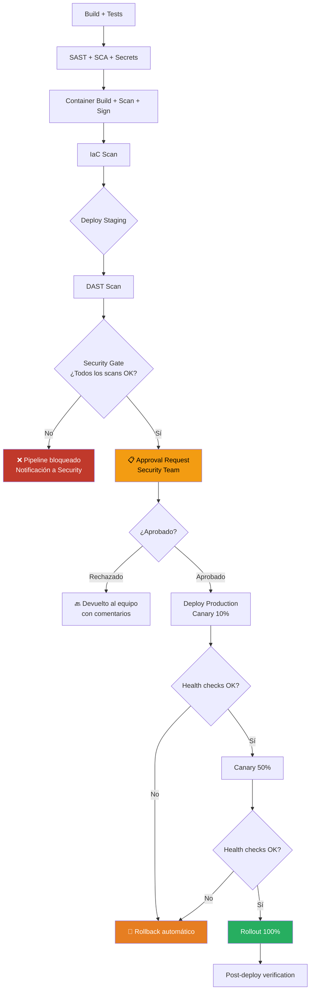
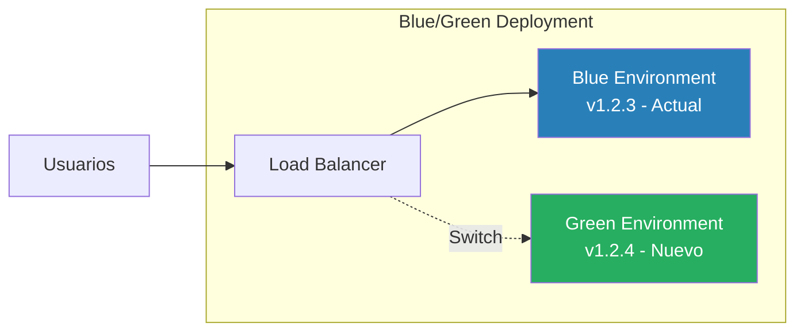
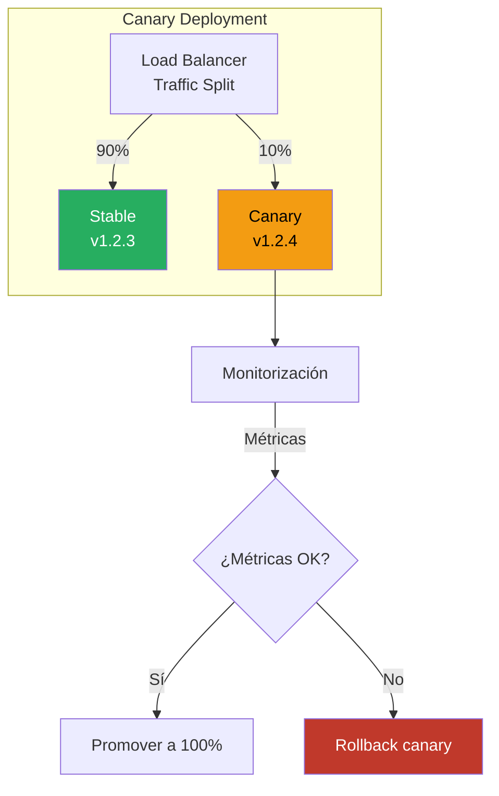
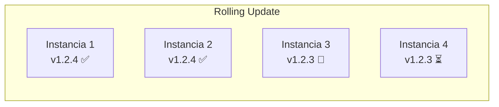
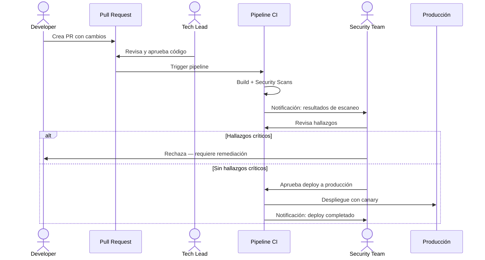
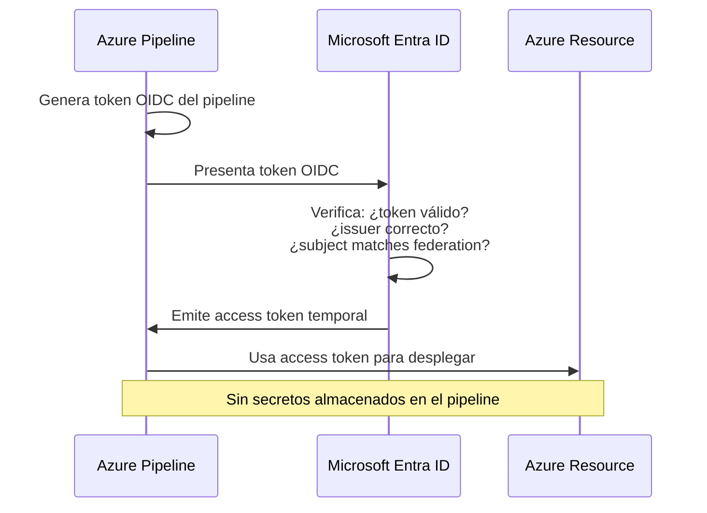

# Concepto 10 — Despliegues Seguros

<div class="lab-meta">
  <div class="lab-meta-item">
    <strong>Duración estimada</strong>
    20 minutos de lectura
  </div>
  <div class="lab-meta-item">
    <strong>Audiencia</strong>
    Equipo de Seguridad
  </div>
  <div class="lab-meta-item">
    <strong>Relevancia</strong>
    Deployment Security & Governance
  </div>
</div>

---

## Introducción

El despliegue es el momento donde el código pasa de ser un artefacto a ser un servicio en producción. Desde la perspectiva de seguridad, es el **punto de máximo riesgo**: un error aquí afecta directamente a usuarios reales, datos reales y sistemas reales.

!!! danger "La pregunta que define este concepto"
    ¿Quién puede desplegar qué, dónde, cuándo y con qué credenciales? Si no puedes responder a cada parte de esta pregunta con precisión, tu proceso de despliegue tiene gaps de seguridad.

---

## GitHub Actions Environments

Los **Environments** en GitHub Actions son un concepto de primera clase que representa un entorno de despliegue (staging, producción, etc.) con controles de seguridad asociados.

### Checks and Approvals disponibles

| Check | Descripción | Uso de seguridad |
|---|---|---|
| **Manual approval** | Requiere aprobación humana | Equipo de seguridad como aprobador obligatorio |
| **Branch control** | Solo permite deploy desde ramas específicas | Solo `main` puede llegar a producción |
| **Business hours** | Solo permite deploy en horario definido | Evita despliegues nocturnos sin supervisión |
| **Template check** | Pipeline debe usar un template aprobado | Garantiza que los stages de seguridad existen |
| **Invoke Azure Function** | Ejecuta validación custom | Verificar que los escaneos de seguridad pasaron |
| **Query Work Items** | Verifica que existan work items asociados | Trazabilidad de cambios |
| **Exclusive lock** | Solo un pipeline a la vez | Evita race conditions en despliegue |
| **Required template** | El pipeline DEBE extender un template específico | Imposible saltarse stages de seguridad |

### Configuración de un Environment seguro

```yaml
# .github/workflows/devsecops.yml
stages:
  # Stages de seguridad previos...
  # job: SecurityScans
    jobs:
      - job: SAST
      - job: SCA
      - job: ImageScan

  # job: DeployStaging
    dependsOn: SecurityScans
    jobs:
      - deployment: DeployToStaging
        environment: 'staging'  # Environment con checks básicos
        strategy:
          runOnce:
            deploy:
              steps:
                - run: echo "Deploying to staging"

  # job: DAST
    dependsOn: DeployStaging
    jobs:
      - job: ZAPScan

  # job: DeployProduction
    dependsOn: DAST
    jobs:
      - deployment: DeployToProd
        environment: 'production'  # Environment con checks estrictos
        strategy:
          canary:
            increments: [10, 50]
            deploy:
              steps:
                - run: echo "Canary deployment"
            on:
              failure:
                steps:
                  - run: echo "Rollback initiated"
```

---

## Pipeline con Approval Gates



---

## Estrategias de Despliegue: Perspectiva de Seguridad

Cada estrategia de despliegue tiene implicaciones de seguridad diferentes. Lo que importa al equipo de seguridad no es la velocidad del rollout, sino la **capacidad de detectar y revertir problemas** antes de que afecten a todos los usuarios.

### Blue/Green



| Aspecto de seguridad | Evaluación |
|---|---|
| **Rollback** | Instantáneo — switch de vuelta a Blue |
| **Blast radius** | Todo o nada — todos los usuarios cambian a la vez |
| **Verificación pre-switch** | Se puede testear Green completamente antes del switch |
| **Coste** | Doble infraestructura = doble superficie de ataque temporal |
| **Secretos** | Ambos entornos necesitan acceso a secretos de producción |
| **Mejor para** | Aplicaciones con estado donde el rollback gradual es difícil |

### Canary



| Aspecto de seguridad | Evaluación |
|---|---|
| **Rollback** | Rápido — solo afecta al % canary |
| **Blast radius** | Controlado — solo un subconjunto de usuarios |
| **Detección de problemas** | Excelente — comparas métricas canary vs stable |
| **Ataques detectables** | Anomalías en tasa de errores, latencia, patrones de acceso |
| **Riesgo** | El subconjunto de usuarios afectados son "conejillos de indias" |
| **Mejor para** | APIs y microservicios stateless |

### Rolling Update



| Aspecto de seguridad | Evaluación |
|---|---|
| **Rollback** | Lento — hay que revertir cada instancia |
| **Blast radius** | Incremental — crece con cada instancia actualizada |
| **Versiones simultáneas** | Sí — durante el rolling hay dos versiones activas |
| **Riesgo** | Incompatibilidad entre v1 y v2 simultáneas (DB migrations) |
| **Secretos** | Si cambian secretos entre versiones, ambas deben funcionar |
| **Mejor para** | Clusters grandes donde blue/green es costoso |

### Comparativa consolidada

| Estrategia | Velocidad rollback | Blast radius | Complejidad | Detección anomalías |
|---|---|---|---|---|
| **Blue/Green** | Instantáneo | Total (switch) | Media | Pre-switch testing |
| **Canary** | Rápido | Controlado (%) | Alta | Comparación métricas |
| **Rolling** | Lento | Incremental | Baja | Limitada |
| **Recreate** | Requiere redeploy | Total + downtime | Baja | Ninguna |

---

## Separación de Deberes

**Separation of Duties (SoD)** es un principio de seguridad que establece que ninguna persona debe tener control completo sobre un proceso crítico. En el contexto de despliegues:

| Rol | Puede hacer | NO puede hacer |
|---|---|---|
| **Developer** | Escribir código, crear PRs, desplegar a dev | Aprobar su propio PR, desplegar a producción |
| **Tech Lead** | Aprobar PRs, desplegar a staging | Aprobar deploy a producción sin security review |
| **Security Team** | Revisar resultados de escaneos, aprobar/rechazar deploy a prod | Modificar código de la aplicación |
| **Platform Team** | Gestionar infraestructura, configurar environments | Aprobar cambios de aplicación |
| **Service Account (Pipeline)** | Ejecutar builds, escaneos, despliegues aprobados | Operar sin que un humano apruebe |



!!! tip "Implementación práctica en GitHub Actions"
    1. Crear un **grupo de seguridad** `Security-Approvers` en GitHub Actions
    2. En el Environment `production`, agregar **Manual Approval** con ese grupo
    3. Configurar **Branch Policy** para requerir al menos 1 revisor de seguridad en PRs
    4. Usar **Required Templates** para que todo pipeline extienda el template de seguridad corporativo

---

## Credenciales de Despliegue

### El problema: ¿Con qué credenciales despliega el pipeline?

| Método | Seguridad | Gestión | Recomendación |
|---|---|---|---|
| **Username/Password en variables** | Baja — secreto estático compartido | Manual, propenso a errores | Evitar |
| **Service Principal + secret** | Media — secreto rotable | Requiere rotación manual | Aceptable si se rota |
| **Service Principal + certificado** | Alta — certificado rotable | Más complejo que secret | Buena |
| **Managed Identity** | Muy alta — sin secretos que gestionar | Azure gestiona todo | Recomendada |
| **Workload Identity Federation (OIDC)** | Muy alta — keyless, vinculado a pipeline | Zero-trust, sin secretos | Mejor opción |

### Workload Identity Federation



!!! info "¿Por qué Workload Identity Federation?"
    - **Sin secretos estáticos**: no hay passwords ni client secrets que puedan filtrarse
    - **Vinculado al pipeline**: solo el pipeline específico puede obtener el token
    - **Temporal**: los tokens expiran en minutos
    - **Auditable**: cada solicitud de token queda registrada en Entra ID

### Principio de mínimo privilegio en despliegues

```hcl
# ❌ MAL: Service principal con Contributor en toda la suscripción
resource "azurerm_role_assignment" "bad" {
  scope                = "/subscriptions/00000000-0000-0000-0000-000000000000"
  role_definition_name = "Contributor"
  principal_id         = var.pipeline_sp_id
}

# ✅ BIEN: Roles específicos en resource groups específicos
resource "azurerm_role_assignment" "web_deploy" {
  scope                = azurerm_resource_group.app.id
  role_definition_name = "Web Plan Contributor"
  principal_id         = var.pipeline_sp_id
}

resource "azurerm_role_assignment" "acr_pull" {
  scope                = azurerm_container_registry.main.id
  role_definition_name = "AcrPull"
  principal_id         = var.app_identity_id
}
```

---

## Rollback: Plan de contingencia obligatorio

Cada despliegue debe tener un **plan de rollback** definido antes de ejecutarse. No es opcional.

### Tipos de rollback

| Tipo | Mecanismo | Velocidad | Riesgo |
|---|---|---|---|
| **Revert de imagen** | Desplegar la versión anterior del contenedor | Segundos-minutos | Bajo |
| **Blue/Green switch** | Cambiar el load balancer de vuelta | Segundos | Muy bajo |
| **Feature flag** | Desactivar la feature sin redesplegar | Instantáneo | Muy bajo |
| **Database rollback** | Ejecutar migration inversa | Minutos-horas | Alto (posible pérdida de datos) |
| **Terraform rollback** | `terraform apply` con state anterior | Minutos | Medio |
| **Redeploy from Git** | Ejecutar pipeline apuntando a commit anterior | Minutos | Bajo |

!!! warning "El rollback de base de datos es el más difícil"
    Si un despliegue incluye migraciones de base de datos destructivas (DROP COLUMN, cambio de tipo), el rollback puede ser imposible sin pérdida de datos. La estrategia de seguridad debe incluir:
    
    - **Migraciones backward-compatible** (expand-and-contract)
    - **Backups pre-deploy** verificados
    - **Dry-run** de la migración en staging con datos reales (anonimizados)

---

## Audit Logging: Trazabilidad completa

Cada despliegue debe generar un registro de auditoría inmutable que responda a las 5W:

| Pregunta | Dato registrado |
|---|---|
| **Who** (Quién) | Identidad que aprobó y ejecutó el despliegue |
| **What** (Qué) | Versión desplegada, commit SHA, imagen digest |
| **Where** (Dónde) | Environment objetivo (staging, production) |
| **When** (Cuándo) | Timestamp exacto de inicio, aprobación y finalización |
| **Why** (Por qué) | Work item asociado, PR vinculado, justificación |

### GitHub Actions genera estos logs automáticamente

```
Pipeline Run #2847
├── Triggered by: merge PR #423 to main
├── Commit: a1b2c3d4 "Fix authentication bypass CVE-2026-1234"
├── Approvals:
│   ├── Code Review: maria.garcia@entelgy.com (2026-04-07 14:23 UTC)
│   └── Security Approval: carlos.lopez@entelgy.com (2026-04-07 15:10 UTC)
├── Scans:
│   ├── SAST: 0 critical, 2 medium (accepted)
│   ├── SCA: 0 critical (clean)
│   ├── Image Scan: 0 critical, 1 low
│   └── DAST: 0 high, 3 informational
├── Deploy to production:
│   ├── Start: 2026-04-07 15:15 UTC
│   ├── Strategy: Canary (10% → 50% → 100%)
│   ├── Image: myacr.azurecr.io/app@sha256:abc123...
│   └── Complete: 2026-04-07 15:42 UTC
└── Post-deploy health: ✅ All checks passed
```

!!! info "Compliance y auditoría"
    Estos logs son esenciales para cumplir con:
    
    - **SOC 2**: Control de cambios y separación de deberes
    - **ISO 27001**: Gestión de cambios (A.12.1.2)
    - **PCI DSS**: Requisito 6.4 — Procesos de control de cambios
    - **ENS (Esquema Nacional de Seguridad)**: Gestión de cambios

---

## Incidentes Reales

!!! example "Caso 1: Knight Capital (2012) — $440M en 45 minutos"
    Un despliegue fallido de software de trading causó que el sistema ejecutara transacciones erróneas durante 45 minutos, resultando en pérdidas de **$440 millones de dólares**. La causa: código obsoleto se activó accidentalmente durante el despliegue porque un técnico olvidó actualizar uno de los ocho servidores. No había canary deployment, no había health checks automáticos, y no había rollback automático. La empresa quebró días después.

!!! example "Caso 2: Cloudflare (2019) — Caída global de 27 minutos"
    Un despliegue de una regla WAF causó una caída global de Cloudflare. La regla usaba una expresión regular catastrófica que consumió el 100% de CPU en todos los servidores. Aunque Cloudflare tenía rollback, tardaron 27 minutos en ejecutarlo porque el sistema de despliegue también estaba detrás de Cloudflare. Lección: el mecanismo de rollback no debe depender del sistema que está fallando.

!!! example "Caso 3: GitLab (2017) — Pérdida de base de datos de producción"
    Un ingeniero de GitLab ejecutó accidentalmente `rm -rf` en el directorio de datos de la base de datos de producción durante una operación de mantenimiento. Cinco métodos de backup distintos fallaron. GitLab fue transparente y compartió el post-mortem públicamente. Lección: los backups no sirven si no se prueban, y las operaciones destructivas necesitan aprobaciones y verificaciones.

---

## El Equipo de Seguridad como Approver

### Qué revisar antes de aprobar un despliegue

| Verificación | Cómo |
|---|---|
| ¿Todos los escaneos de seguridad pasaron? | Revisar artefactos del pipeline (SAST, SCA, DAST, IaC) |
| ¿Las vulnerabilidades encontradas fueron aceptadas conscientemente? | Revisar excepciones documentadas |
| ¿La imagen está firmada? | Verificar firma Cosign en el artefacto |
| ¿El PR fue revisado por al menos 2 personas? | Verificar en el PR vinculado |
| ¿Hay plan de rollback documentado? | Verificar en el work item |
| ¿Se despliega desde la rama correcta? | Branch control en el environment |
| ¿Es horario de despliegue autorizado? | Business hours check |

!!! tip "Automatiza lo que puedas"
    La aprobación manual debe ser el **último** control, no el **único**. Los checks automáticos (branch control, required template, invoke Azure Function para verificar scans) deben hacer la mayor parte del trabajo. El aprobador humano solo valida lo que no se puede automatizar.

---

## Resumen para el Equipo de Seguridad

| Control | Qué resuelve | Implementación |
|---|---|---|
| Environments con approvals | Separación de deberes | GitHub Actions Environment checks |
| Branch control | Solo código revisado llega a prod | Branch policy en environment |
| Canary/Blue-Green | Limita blast radius | Deployment strategy en YAML |
| Rollback automático | Recuperación rápida ante fallos | Health checks + auto-rollback |
| Workload Identity Federation | Elimina secretos de despliegue | OIDC entre pipeline y Azure |
| Mínimo privilegio | Limita daño si el pipeline se compromete | Role assignments específicos |
| Audit logging | Trazabilidad para compliance | Nativo en GitHub Actions |
| Required templates | Imposible saltarse controles de seguridad | Template checks en environments |

---

<div style="display: flex; justify-content: space-between; margin-top: 2rem;">
  <a href="../../lab09-iac/" class="md-button">:material-arrow-left: Lab 9 — Escaneo de IaC</a>
  <a href="../../lab10-deploy/" class="md-button md-button--primary">Lab 10 — Deploy con Aprobaciones :material-arrow-right:</a>
</div>
