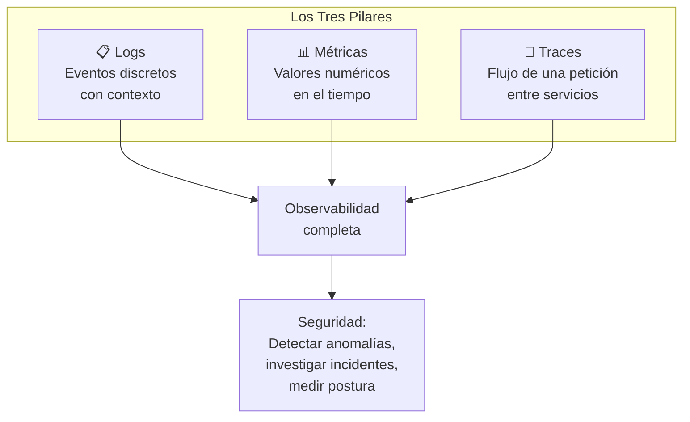
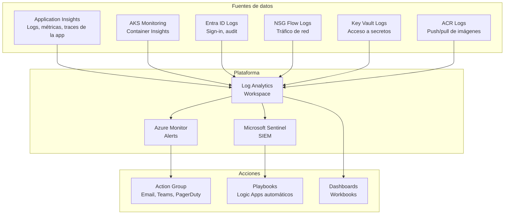
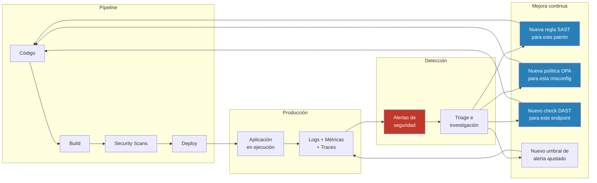

# Concepto 11 — Monitorización para Seguridad

<div class="lab-meta">
  <div class="lab-meta-item">
    <strong>Duración estimada</strong>
    20 minutos de lectura
  </div>
  <div class="lab-meta-item">
    <strong>Audiencia</strong>
    Equipo de Seguridad
  </div>
  <div class="lab-meta-item">
    <strong>Relevancia</strong>
    Runtime Security & Detection
  </div>
</div>

---

## Introducción

DevSecOps no termina cuando el código llega a producción. La **monitorización** es la última etapa del pipeline y, al mismo tiempo, la **primera etapa del siguiente ciclo**. Sin monitorización de seguridad, estás volando a ciegas: no sabes si te están atacando, si un despliegue introdujo una regresión de seguridad, o si una credencial fue comprometida.

!!! info "Shift-right: la otra mitad de DevSecOps"
    Mucho se habla de **shift-left** (mover la seguridad al inicio del desarrollo). Pero **shift-right** es igualmente importante: monitorizar la aplicación en producción para detectar lo que los escaneos estáticos y dinámicos no pudieron anticipar.

---

## Los Tres Pilares de la Observabilidad

La observabilidad es la capacidad de entender el estado interno de un sistema a partir de sus outputs externos. Se basa en tres pilares:



### Cada pilar desde la perspectiva de seguridad

| Pilar | Qué registra | Valor para seguridad | Ejemplo |
|---|---|---|---|
| **Logs** | Eventos con timestamp, contexto y detalle | Registro forense de actividad | `2026-04-07T15:23:01Z user=admin action=login status=failed ip=185.143.x.x` |
| **Métricas** | Series temporales numéricas | Detección de anomalías por umbrales | `auth_failures_total{endpoint="/login"} = 847` (vs baseline de 12) |
| **Traces** | Camino de una request a través de microservicios | Detectar lateral movement, tiempos anómalos | Request pasó por servicio no esperado, latencia 10x normal |

---

## Monitorización de Seguridad: ¿Qué vigilar?

### Eventos críticos para el equipo de seguridad

| Categoría | Eventos a monitorizar | Acción |
|---|---|---|
| **Autenticación** | Logins fallidos repetidos, logins desde IPs/países inusuales, uso de cuentas inactivas | Alerta + investigación |
| **Autorización** | Acceso denegado a recursos, intentos de escalación de privilegios, acceso a APIs no autorizadas | Alerta inmediata |
| **Datos** | Volumen de datos descargados anómalo, queries a tablas sensibles, export masivo | Alerta + bloqueo potencial |
| **Configuración** | Cambios en IAM roles, modificación de NSGs, desactivación de logging | Alerta inmediata |
| **Runtime** | Procesos inesperados en contenedores, conexiones de red a IPs maliciosas, escritura en filesystem readonly | Alerta + aislamiento |
| **API** | Rate de peticiones anómalo, payloads con patrones de inyección, responses con stack traces | Alerta + rate limiting |
| **Despliegue** | Deploy fuera de horario, deploy sin aprobación (si es posible), imagen no firmada | Alerta + rollback |

### Señales de compromiso en logs

```
# ⚠️ Brute force en autenticación
auth_failures{user="admin"} > 50 en 5 minutos

# ⚠️ Posible credential stuffing
auth_failures{distinct_users} > 100 en 10 minutos desde misma IP

# ⚠️ Posible data exfiltration
api_response_bytes{endpoint="/api/users/export"} > 100MB en 1 hora

# ⚠️ Escalación de privilegios
audit_log{action="role_assignment", role="Owner"} 
desde user que nunca antes hizo esta operación

# ⚠️ Lateral movement
network_connections{source="web-pod", destination="db-pod", port="22"}
SSH desde un pod web a la base de datos — no debería ocurrir

# ⚠️ Container escape attempt
syscall{type="mount", container="app"} OR
syscall{type="ptrace", container="app"}
```

---

## Azure Monitor y Application Insights

### Arquitectura de monitorización en Azure



### Queries KQL para seguridad

=== "Logins fallidos"

    ```kusto
    // Top 10 IPs con más logins fallidos en las últimas 24h
    SigninLogs
    | where TimeGenerated > ago(24h)
    | where ResultType != 0  // No exitoso
    | summarize FailedAttempts = count(), 
                DistinctUsers = dcount(UserPrincipalName)
                by IPAddress
    | order by FailedAttempts desc
    | take 10
    ```

=== "Acceso anómalo a Key Vault"

    ```kusto
    // Accesos a Key Vault fuera de horario laboral
    AzureDiagnostics
    | where ResourceType == "VAULTS"
    | where TimeGenerated > ago(24h)
    | extend Hour = datetime_part("hour", TimeGenerated)
    | where Hour < 7 or Hour > 20  // Fuera de 7am-8pm
    | project TimeGenerated, CallerIPAddress, 
              OperationName, ResultType, 
              Resource
    | order by TimeGenerated desc
    ```

=== "Imágenes no firmadas en ACR"

    ```kusto
    // Pulls de imágenes que no fueron firmadas con Cosign
    ContainerRegistryRepositoryEvents
    | where TimeGenerated > ago(7d)
    | where OperationName == "Pull"
    | join kind=leftanti (
        ContainerRegistryRepositoryEvents
        | where OperationName == "Push"
        | where MediaType contains "cosign"
    ) on Repository, Digest
    | project TimeGenerated, Repository, Digest, 
              CallerIPAddress, LoginServer
    ```

=== "Anomalías en API"

    ```kusto
    // Endpoints con tasa de error > 5% en la última hora
    requests
    | where timestamp > ago(1h)
    | summarize TotalRequests = count(),
                FailedRequests = countif(resultCode >= 400),
                AvgDuration = avg(duration)
                by name
    | extend ErrorRate = round(FailedRequests * 100.0 / TotalRequests, 2)
    | where ErrorRate > 5
    | order by ErrorRate desc
    ```

---

## Alerting: Equipo de Seguridad vs Equipo de Desarrollo

No todas las alertas van al mismo equipo. Definir la routing de alertas correctamente es crítico para evitar fatiga de alertas y asegurar respuesta rápida.

### Matriz de routing de alertas

| Alerta | Severidad | Equipo | Canal | Respuesta esperada |
|---|---|---|---|---|
| Brute force en login | Alta | Security | PagerDuty + Teams | < 15 min |
| Deploy fallido | Media | Dev | Teams + Email | < 1 hora |
| CVE crítico en imagen en producción | Crítica | Security + Dev | PagerDuty | < 30 min |
| Health check falla post-deploy | Alta | Dev + SRE | PagerDuty | < 5 min (auto-rollback) |
| Cambio de IAM role a Owner | Crítica | Security | PagerDuty + SMS | < 10 min |
| Error rate > 10% | Alta | Dev + SRE | PagerDuty | < 15 min |
| Acceso a Key Vault fuera de horario | Media | Security | Teams + Email | < 1 hora |
| Container con proceso inesperado | Crítica | Security + Platform | PagerDuty | < 10 min |
| Certificado TLS expira en < 30 días | Baja | Platform | Email | < 1 semana |

!!! warning "La fatiga de alertas mata la seguridad"
    Si el equipo de seguridad recibe 200 alertas diarias, no responderá a ninguna con la urgencia necesaria. La clave es:
    
    - **Priorizar**: solo alertas accionables con severidad clara
    - **Eliminar ruido**: tuning continuo de umbrales
    - **Automatizar respuesta**: playbooks para alertas repetitivas
    - **Escalar correctamente**: no todo va a PagerDuty a las 3am

---

## Verificación Post-Despliegue

Cada despliegue debe incluir verificaciones automáticas que confirmen que la aplicación funciona correctamente y que no se introdujeron regresiones de seguridad.

### Checks post-deploy

| Check | Qué verifica | Herramienta |
|---|---|---|
| **Health endpoint** | La app responde y está healthy | curl + pipeline |
| **Smoke tests** | Flujos críticos de negocio funcionan | Tests automatizados |
| **Security headers** | Headers de seguridad presentes en responses | Script custom o ZAP baseline |
| **TLS certificate** | Certificado válido y no próximo a expirar | openssl s_client |
| **Error rate baseline** | Tasa de errores no aumentó tras deploy | Azure Monitor metric alert |
| **Latency baseline** | Latencia no aumentó significativamente | Application Insights |
| **Vulnerability scan** | No se introdujeron nuevas vulnerabilidades runtime | DAST baseline rápido |

```yaml
# Ejemplo: post-deploy verification en Azure Pipeline
# job: PostDeployVerification
  dependsOn: DeployProduction
  jobs:
    - job: HealthChecks
      steps:
        - run: |
            # Verificar health endpoint
            STATUS=$(curl -s -o /dev/null -w "%{http_code}" https://myapp.com/health)
            if [ "$STATUS" != "200" ]; then
              echo "echo '::error::Health check failed: HTTP $STATUS"
              exit 1
            fi
          name: 'Health Check'
        
        - run: |
            # Verificar security headers
            HEADERS=$(curl -sI https://myapp.com)
            for HEADER in "Strict-Transport-Security" "X-Content-Type-Options" "X-Frame-Options" "Content-Security-Policy"; do
              if ! echo "$HEADERS" | grep -qi "$HEADER"; then
                echo "echo '::warning::Missing header: $HEADER"
              fi
            done
          name: 'Security Headers Check'
        
        - run: |
            # Verificar TLS
            EXPIRY=$(echo | openssl s_client -servername myapp.com -connect myapp.com:443 2>/dev/null | openssl x509 -noout -enddate | cut -d= -f2)
            echo "Certificate expires: $EXPIRY"
          name: 'TLS Certificate Check'
```

---

## El Feedback Loop: De producción al pipeline

La monitorización cierra el ciclo de DevSecOps. Los hallazgos en producción alimentan mejoras en el pipeline.



### Ejemplos concretos del feedback loop

| Hallazgo en producción | Acción en el pipeline |
|---|---|
| Ataque XSS detectado en WAF logs | Agregar regla Semgrep que detecte el patrón vulnerable |
| Brute force en endpoint `/api/login` | Agregar check DAST que verifique rate limiting |
| Contenedor ejecuta proceso `cryptominer` | Agregar política que bloquee imágenes sin user no-root |
| Storage account cambió a público (drift) | Agregar check Checkov + drift detection programado |
| Dependencia con CVE crítico explotada | Actualizar política SCA para bloquear la versión afectada |
| Secreto expuesto en Application Insights | Agregar regla de data masking en logging framework |

!!! tip "El feedback loop es lo que diferencia DevSecOps maduro de DevSecOps superficial"
    Un pipeline con SAST, SCA y DAST es un buen comienzo. Pero si los hallazgos en producción no se traducen en nuevas reglas y políticas en el pipeline, estás repitiendo los mismos errores una y otra vez. La monitorización **cierra el ciclo**.

---

## Herramientas del Ecosistema Azure

| Herramienta | Función | Uso para seguridad |
|---|---|---|
| **Azure Monitor** | Plataforma de observabilidad | Métricas, alertas, dashboards |
| **Application Insights** | APM para aplicaciones | Traces, dependencias, excepciones, request logging |
| **Log Analytics** | Almacén centralizado de logs | Queries KQL, correlación entre fuentes |
| **Microsoft Sentinel** | SIEM cloud-native | Detección de amenazas, playbooks automatizados, hunting |
| **Microsoft Defender for Cloud** | CSPM + CWPP | Postura de seguridad, protección de workloads |
| **Container Insights** | Monitorización de AKS/containers | Métricas de pods, logs de contenedores |
| **Network Watcher** | Monitorización de red | NSG flow logs, diagnóstico de conectividad |

### Microsoft Sentinel: Para equipos de seguridad maduros

Si tu organización ya tiene un SOC o está construyendo uno, **Microsoft Sentinel** es el paso natural. Agrega:

- **Detección basada en reglas**: alertas cuando se cumplen condiciones específicas
- **Detección basada en ML**: anomalías que los humanos no detectarían
- **Playbooks automatizados**: respuesta automática a incidentes comunes
- **Hunting**: búsqueda proactiva de amenazas con KQL
- **Integración con MITRE ATT&CK**: mapeo de detecciones a tácticas y técnicas conocidas

---

## Incidentes Reales

!!! example "Caso 1: Target (2013) — 40 millones de tarjetas comprometidas"
    Target tenía un sistema de monitorización (FireEye) que **detectó el malware** en sus sistemas POS. El equipo de seguridad en Bangalore generó alertas. **Nadie respondió.** Las alertas fueron ignoradas durante semanas mientras los atacantes exfiltraban datos de 40 millones de tarjetas de crédito. Lección: la monitorización sin proceso de respuesta es inútil. Las alertas deben tener owners claros, SLAs de respuesta, y escalación automática.

!!! example "Caso 2: SolarWinds / Solorigate (2020) — Meses sin detección"
    El ataque a SolarWinds pasó desapercibido durante **9 meses** a pesar de que los atacantes estaban activos en las redes de organizaciones víctimas. La detección finalmente vino de FireEye, una empresa de seguridad que notó un acceso anómalo a sus propios sistemas. Lección: la monitorización de comportamiento anómalo (baseline + desviaciones) es esencial. Los atacantes sofisticados evitan triggers obvios.

!!! example "Caso 3: Log4Shell (2021) — Explotación masiva en horas"
    Cuando se publicó la vulnerabilidad Log4Shell (CVE-2021-44228), los atacantes comenzaron explotación masiva en **horas**. Las organizaciones con buena monitorización detectaron los intentos de explotación en sus WAF logs y logs de aplicación (strings como `${jndi:ldap://...}`). Las que no monitorizaban fueron comprometidas sin saberlo. Lección: la monitorización en tiempo real permite detección temprana incluso de zero-days.

---

## Resumen para el Equipo de Seguridad

| Control | Qué resuelve | Herramienta |
|---|---|---|
| Logging centralizado | Visibilidad completa de eventos | Log Analytics Workspace |
| Métricas de seguridad | Detección de anomalías por umbral | Azure Monitor Alerts |
| Distributed tracing | Investigación de incidentes cross-service | Application Insights |
| SIEM | Correlación de eventos, detección avanzada | Microsoft Sentinel |
| Post-deploy verification | Detectar regresiones tras despliegue | Pipeline + health checks |
| Alerting con routing | Respuesta rápida del equipo correcto | Action Groups |
| Feedback loop | Mejora continua del pipeline | Nuevas reglas SAST/SCA/DAST/OPA |
| Dashboards de seguridad | Visibilidad ejecutiva de postura | Azure Workbooks |

!!! abstract "Regla de oro"
    **Si no lo monitorizas, no sabes que está pasando. Si no alertas, nadie responde. Si no cierras el loop, repites los mismos errores.** La monitorización es el sistema nervioso de DevSecOps.

---

<div style="display: flex; justify-content: space-between; margin-top: 2rem;">
  <a href="../../lab10-deploy/" class="md-button">:material-arrow-left: Lab 10 — Deploy con Aprobaciones</a>
  <a href="../../lab11-monitorizacion/" class="md-button md-button--primary">Lab 11 — Monitorización Post-Despliegue :material-arrow-right:</a>
</div>
