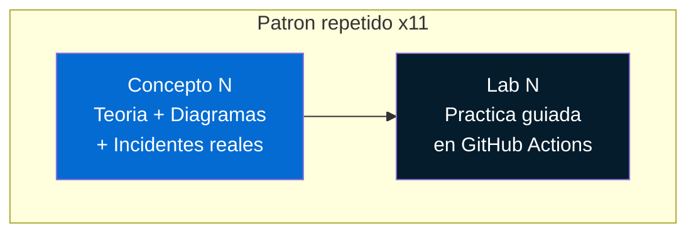
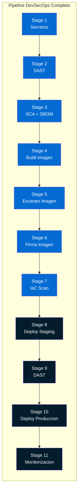

# Modulo 0 — Bienvenida al Workshop

## Por que existe este workshop

Los equipos de seguridad se enfrentan a un cambio fundamental: las organizaciones
despliegan decenas de veces al dia usando pipelines automatizados. Los controles
manuales — revisiones periodicas, pentests anuales, aprobaciones en comite — ya
no escalan. Si la seguridad no esta **dentro** del pipeline, no existe.

!!! danger "La realidad"
    Segun el reporte DORA 2024, los equipos elite despliegan bajo demanda
    (multiples veces al dia). Un equipo de seguridad que revisa cambios
    manualmente se convierte en un cuello de botella... o peor, en un paso
    que simplemente se omite.

Este workshop te ensenara a **entender, auditar e instrumentar** pipelines
CI/CD desde la perspectiva de un analista de seguridad. No necesitas ser
desarrollador — necesitas entender como funcionan los pipelines para poder
asegurarlos.

---

## Para quien es este workshop

| Perfil | Que obtendras |
|--------|---------------|
| **Analista de seguridad** | Capacidad de auditar pipelines, entender riesgos y proponer controles |
| **Arquitecto de seguridad** | Diseno de pipeline DevSecOps como blueprint para la organizacion |
| **CISO / Security Manager** | Vision de como la automatizacion reemplaza controles manuales |
| **GRC / Compliance** | Entendimiento de como el pipeline genera evidencia automatica |
| **Pentester** | Superficie de ataque del pipeline como vector (supply chain) |

!!! info "No es un workshop de desarrollo"
    No escribiras aplicaciones. Trabajaras con una aplicacion vulnerable
    pre-construida (`vulnerable-app`) que simula un proyecto real con fallos
    de seguridad intencionales. Tu trabajo es instrumentar el pipeline que la
    protege.

---

## Estructura del workshop

El workshop sigue un patron estricto de **Concepto + Lab**:



1. **Concepto** (~20-30 min): Teoria con diagramas Mermaid, tablas comparativas,
   incidentes reales del mundo de la seguridad y admonitions con insights clave.
2. **Lab** (~20-40 min): Practica guiada paso a paso en GitHub Actions donde
   implementas el control de seguridad del concepto anterior.

---

## Herramientas del workshop

| Herramienta | Proposito | Fase del pipeline |
|-------------|-----------|-------------------|
| **GitHub Actions** | Plataforma CI/CD | Toda la pipeline |
| **Git** | Control de versiones | Pre-commit, CI |
| **Gitleaks** | Deteccion de secretos | Pre-commit, CI |
| **Semgrep** | Analisis estatico (SAST) | CI |
| **Trivy** | SCA, escaneo de imagenes, SBOM | CI |
| **Docker** | Construccion de imagenes | CI |
| **Cosign** | Firma de imagenes | CI |
| **OWASP ZAP** | Analisis dinamico (DAST) | CD (Staging) |
| **Checkov** | Escaneo de IaC | CI |
| **OPA / Conftest** | Politicas como codigo | CI |
| **Terraform** | Infraestructura como Codigo | CD |
| **GitHub Secrets** | Gestion de secretos | Runtime |
| **Azure Monitor** | Monitorizacion post-deploy | Produccion |

---

## Que construiras: el pipeline final

Al terminar los 11 labs, tendras un pipeline completo con 11 stages de seguridad:



Cada stage que anadiras genera:

- **Evidencia auditable** — logs, reportes SARIF/JSON, SBOMs
- **Gates de seguridad** — el pipeline falla si se detectan vulnerabilidades criticas
- **Trazabilidad** — cada artefacto esta firmado y vinculado al commit que lo genero

---

## Mapa del workshop

| # | Concepto | Lab | Herramienta principal |
|---|----------|-----|-----------------------|
| 1 | CI/CD y Seguridad | Proyecto GitHub Actions | GitHub Actions |
| 2 | Anatomia del Pipeline | Pipeline Base | GitHub Actions YAML |
| 3 | Secretos en Codigo | Deteccion de Secretos | Gitleaks |
| 4 | Analisis Estatico | SAST con Semgrep | Semgrep |
| 5 | Cadena de Suministro | SCA y SBOM | Trivy |
| 6 | Artefactos e Inmutabilidad | Build e Imagen | Docker + GHCR |
| 7 | Registros y Confianza | Firma de Imagen | Cosign |
| 8 | Pruebas Dinamicas | DAST con OWASP ZAP | OWASP ZAP |
| 9 | IaC y Seguridad | Escaneo de IaC | Checkov + OPA |
| 10 | Despliegues Seguros | Deploy con Aprobaciones | GitHub Environments |
| 11 | Monitorizacion | Dashboard de Seguridad | Azure Monitor |

---

## Convenciones usadas en el workshop

!!! tip "Consejo"
    Indica una buena practica o un atajo util.

!!! warning "Advertencia"
    Senala un error comun o un riesgo a evitar.

!!! danger "Peligro"
    Marca un riesgo critico de seguridad o un anti-patron grave.

!!! info "Contexto"
    Proporciona informacion adicional relevante para el equipo de seguridad.

!!! example "Incidente real"
    Describe un caso documentado publicamente para contextualizar el concepto.

Los bloques de codigo que debes ejecutar aparecen asi:

```bash
# Esto es un comando que debes ejecutar
az devops project list --output table
```

Los bloques de YAML para el pipeline aparecen con el nombre del archivo:

```yaml title=".github/workflows/devsecops.yml"
trigger:
  - main
```

---

<div style="display: flex; justify-content: space-between; margin-top: 2rem;">
<span></span>
[Siguiente: Prerequisitos :octicons-arrow-right-24:](prerequisites.md){ .md-button .md-button--primary }
</div>
