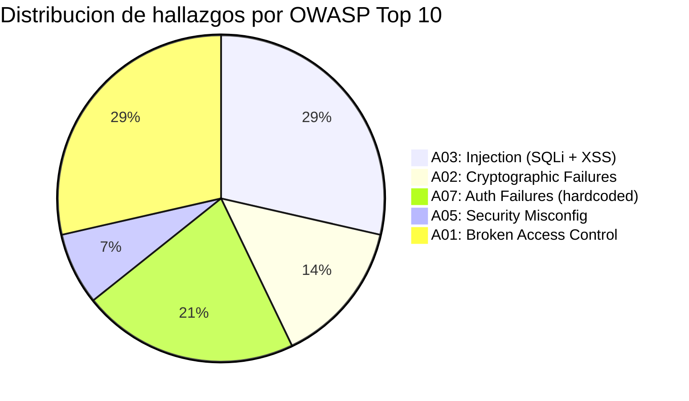

# Stage 2 — Analisis Estatico SAST (Semgrep)

<div class="lab-meta">
  <div class="lab-meta-item">
    <strong>Herramienta</strong>
    Semgrep OSS
  </div>
  <div class="lab-meta-item">
    <strong>Artefacto</strong>
    semgrep-report (SARIF)
  </div>
  <div class="lab-meta-item">
    <strong>Hallazgos esperados</strong>
    ~14 findings
  </div>
</div>

---

## Que hace este stage

Semgrep analiza el codigo fuente **sin ejecutarlo**, aplicando tres conjuntos de reglas: `p/owasp-top-ten`, `p/secrets` y `p/python`. Detecta patrones peligrosos como inyecciones SQL, XSS, uso de hashing debil y secretos hardcodeados. El resultado se exporta en SARIF y se sube a GitHub Security para visualizacion centralizada.

---

## YAML del Workflow

```yaml
sast:
  name: '2. Analisis Estatico (SAST)'
  runs-on: ubuntu-latest
  needs: secrets-detection
  if: always()
  steps:
    - uses: actions/checkout@v5

    - name: Instalar Semgrep
      run: pip install semgrep

    - name: Semgrep -- SAST Scan
      run: |
        semgrep scan \
          --config=p/owasp-top-ten \
          --config=p/secrets \
          --config=p/python \
          --sarif --output=semgrep.sarif \
          . || true

    - name: Upload SARIF a GitHub Security
      uses: github/codeql-action/upload-sarif@v4
      if: always()
      with:
        sarif_file: semgrep.sarif
        category: semgrep

    - name: Publicar reporte Semgrep
      uses: actions/upload-artifact@v5
      if: always()
      with:
        name: semgrep-report
        path: semgrep.sarif
        retention-days: 30
```

---

## Hallazgos esperados

| # | Archivo | Linea | Hallazgo | CWE | Severidad | OWASP Top 10 |
|---|---------|-------|----------|-----|-----------|--------------|
| 1 | `app/login.py` | 15 | SQL Injection — `f-string` en query | CWE-89 | :material-alert: **ERROR** | A03: Injection |
| 2 | `app/login.py` | 28 | SQL Injection — concatenacion en query | CWE-89 | :material-alert: **ERROR** | A03: Injection |
| 3 | `app/search.py` | 12 | XSS — input del usuario en HTML sin escapar | CWE-79 | :material-alert: **ERROR** | A03: Injection |
| 4 | `app/search.py` | 22 | XSS — render_template_string con datos | CWE-79 | :material-alert: **ERROR** | A03: Injection |
| 5 | `app/crypto.py` | 8 | Uso de MD5 para hashing | CWE-328 | :material-alert-outline: WARNING | A02: Crypto Failures |
| 6 | `app/crypto.py` | 14 | Uso de SHA1 (debil) | CWE-328 | :material-alert-outline: WARNING | A02: Crypto Failures |
| 7 | `app/users.py` | 5 | Hardcoded password | CWE-798 | :material-alert: **ERROR** | A07: Auth Failures |
| 8 | `app/users.py` | 8 | Hardcoded API key | CWE-798 | :material-alert: **ERROR** | A07: Auth Failures |
| 9 | `app/app.py` | 3 | Flask debug=True en produccion | CWE-489 | :material-alert-outline: WARNING | A05: Security Misconfig |
| 10 | `app/app.py` | 12 | SECRET_KEY hardcodeado | CWE-798 | :material-alert: **ERROR** | A07: Auth Failures |
| 11-14 | `infrastructure/*.tf` | varios | Recursos Terraform inseguros | CWE-284 | :material-alert-outline: WARNING | A01: Broken Access Control |

!!! example "Salida tipica de Semgrep en el log"

    ```
    Scanning 12 files with 450+ rules...

      vulnerable-app/app/login.py
        15: cursor.execute(f"SELECT * FROM users WHERE username='{username}'")
            [ERROR] python.lang.security.audit.sqli.tainted-sql-string

      vulnerable-app/app/search.py
        12: return "<h1>Results for: " + query + "</h1>"
            [ERROR] python.flask.security.xss.direct-use-of-jinja2

      vulnerable-app/app/crypto.py
         8: hashlib.md5(password.encode())
            [WARNING] python.cryptography.security.insecure-hash-algorithms.insecure-md5

    Ran 450+ rules on 12 files: 14 findings.
    ```

---

## Mapeo a OWASP Top 10



---

## Donde verificar en GitHub

!!! tip "Que veras en la interfaz"

    1. **Security** > **Code scanning alerts** > filtra por **Tool: semgrep**.
    2. Cada alerta muestra el archivo, la linea, el snippet de codigo vulnerable y la regla Semgrep que detecto el problema.
    3. Las alertas de severidad `Error` aparecen con icono rojo; las `Warning` con icono amarillo.
    4. Puedes hacer click en cada alerta para ver la **explicacion completa** de la regla, incluyendo un ejemplo de codigo corregido.
    5. En **Actions** > **Artifacts**, descarga `semgrep-report` para analisis offline.

---

[:material-arrow-left: Anterior: Secretos (Gitleaks)](01-secretos.md){ .md-button }
[:material-arrow-right: Siguiente: SCA (Trivy FS)](03-sca.md){ .md-button .md-button--primary }
