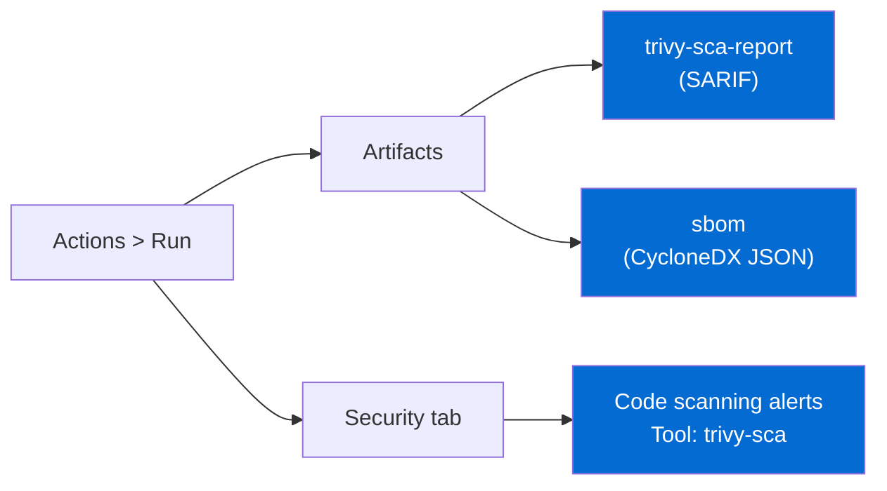

# Stage 3 — Analisis de Composicion SCA (Trivy FS)

<div class="lab-meta">
  <div class="lab-meta-item">
    <strong>Herramienta</strong>
    Trivy (modo filesystem)
  </div>
  <div class="lab-meta-item">
    <strong>Artefactos</strong>
    trivy-sca-report + sbom
  </div>
  <div class="lab-meta-item">
    <strong>Salida</strong>
    CVEs + SBOM CycloneDX
  </div>
</div>

---

## Que hace este stage

Trivy escanea los archivos de dependencias del proyecto (`requirements.txt`, `Pipfile.lock`, etc.) buscando **vulnerabilidades conocidas (CVEs)** en las librerias utilizadas. Solo reporta severidades `CRITICAL` y `HIGH`. Ademas, genera un **SBOM** (Software Bill of Materials) en formato CycloneDX que lista todas las dependencias del proyecto con sus versiones exactas.

---

## YAML del Workflow

```yaml
sca:
  name: '3. Analisis de Composicion (SCA)'
  runs-on: ubuntu-latest
  needs: sast
  if: always()
  steps:
    - uses: actions/checkout@v5

    - name: Trivy FS -- Dependency Scan
      uses: aquasecurity/trivy-action@master
      with:
        scan-type: fs
        scan-ref: .
        severity: CRITICAL,HIGH
        exit-code: "0"
        format: sarif
        output: trivy-sca.sarif

    - name: Upload SARIF a GitHub Security
      uses: github/codeql-action/upload-sarif@v4
      if: always()
      with:
        sarif_file: trivy-sca.sarif
        category: trivy-sca

    - name: Generar SBOM (CycloneDX)
      uses: aquasecurity/trivy-action@master
      with:
        scan-type: fs
        scan-ref: .
        format: cyclonedx
        output: sbom.json

    - name: Publicar SBOM
      uses: actions/upload-artifact@v5
      with:
        name: sbom
        path: sbom.json
        retention-days: 90
```

---

## CVEs esperadas

| Paquete | Version | CVE | Severidad | Descripcion |
|---------|---------|-----|-----------|-------------|
| Flask | 3.0.0 | CVE-2023-30861 | :material-alert: **HIGH** | Caching de cookies de sesion en proxies |
| Werkzeug | 3.0.0 | CVE-2023-46136 | :material-alert: **HIGH** | DoS via multipart form parsing |
| cryptography | 41.0.7 | CVE-2024-26130 | :material-alert-circle: **CRITICAL** | Null pointer dereference en PKCS12 |
| cryptography | 41.0.7 | CVE-2023-50782 | :material-alert: **HIGH** | Bleichenbacher timing oracle en PKCS#1 v1.5 |
| requests | 2.28.0 | CVE-2023-32681 | :material-alert: **HIGH** | Fuga de header Authorization en redirect |

!!! example "Salida tipica de Trivy en modo tabla"

    ```
    Python (requirements.txt)
    =========================
    Total: 5 (HIGH: 4, CRITICAL: 1)

    +----------------+---------+----------------+---------------+---------------------------------------+
    |    LIBRARY     | VERSION |      CVE       |   SEVERITY    |                 TITLE                 |
    +----------------+---------+----------------+---------------+---------------------------------------+
    | Flask          | 3.0.0   | CVE-2023-30861 | HIGH          | Session cookie caching                |
    | Werkzeug       | 3.0.0   | CVE-2023-46136 | HIGH          | DoS multipart parsing                 |
    | cryptography   | 41.0.7  | CVE-2024-26130 | CRITICAL      | PKCS12 null pointer dereference       |
    | cryptography   | 41.0.7  | CVE-2023-50782 | HIGH          | Bleichenbacher timing oracle          |
    | requests       | 2.28.0  | CVE-2023-32681 | HIGH          | Auth header leak on redirect          |
    +----------------+---------+----------------+---------------+---------------------------------------+
    ```

---

## Que es un SBOM y por que importa

!!! info "Software Bill of Materials (SBOM)"

    Un SBOM es un **inventario completo** de todos los componentes de software incluidos en tu aplicacion. Piensa en el como la "lista de ingredientes" de tu software.

    **Por que lo necesitas:**

    - **Respuesta a incidentes**: cuando se anuncia una CVE nueva (ej. Log4Shell), puedes saber en segundos si tu app esta afectada.
    - **Cumplimiento regulatorio**: NIST, EU Cyber Resilience Act y ordenes ejecutivas de EE.UU. exigen SBOMs.
    - **Visibilidad de la supply chain**: sabes exactamente que hay dentro de tu aplicacion.

    El SBOM generado en formato **CycloneDX JSON** se almacena como artefacto con retencion de **90 dias** (mas que los reportes de seguridad) por su valor de inventario.

---

## Donde verificar en GitHub



!!! tip "Que veras en la interfaz"

    1. **Security** > **Code scanning alerts** > filtra por **Tool: trivy-sca**.
    2. Cada CVE aparece como una alerta individual con enlace al advisory de la base de datos NVD.
    3. En **Actions** > click en el run > **Artifacts**, encontraras dos archivos:
        - `trivy-sca-report` — reporte SARIF con las vulnerabilidades.
        - `sbom` — archivo `sbom.json` en formato CycloneDX que puedes importar en herramientas como Dependency-Track o GUAC.
    4. El SBOM incluye cada paquete con su nombre, version, tipo (`library`), y hash (`purl`).

---

[:material-arrow-left: Anterior: SAST (Semgrep)](02-sast.md){ .md-button }
[:material-arrow-right: Siguiente: Build + Imagen](04-build.md){ .md-button .md-button--primary }
