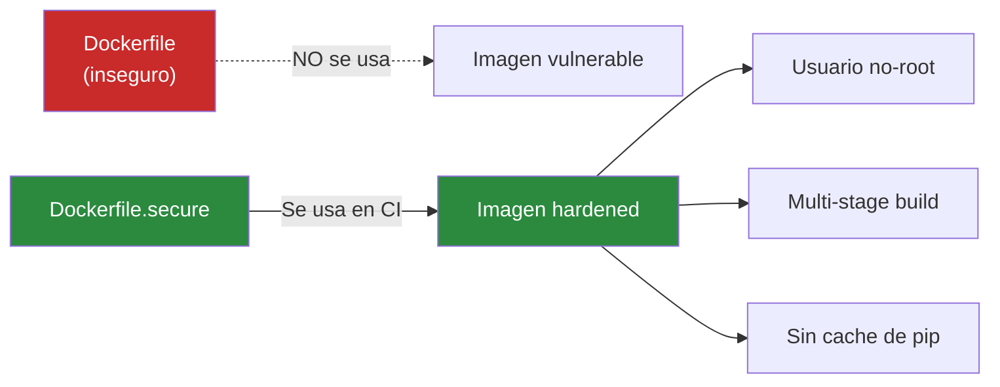

# Stage 4 — Build + Imagen de Contenedor

<div class="lab-meta">
  <div class="lab-meta-item">
    <strong>Herramienta</strong>
    Docker Build + GHCR
  </div>
  <div class="lab-meta-item">
    <strong>Dockerfile</strong>
    Dockerfile.secure
  </div>
  <div class="lab-meta-item">
    <strong>Salida</strong>
    Imagen publicada con 2 tags
  </div>
</div>

---

## Que hace este stage

Construye la imagen Docker usando `Dockerfile.secure` (no el Dockerfile inseguro) y la publica en **GitHub Container Registry** (ghcr.io). La imagen se etiqueta con dos tags inmutables: el **numero de run** del pipeline y el **SHA corto** del commit. Esto garantiza trazabilidad completa entre el codigo fuente y la imagen desplegada.

---

## YAML del Workflow

```yaml
build:
  name: '4. Build + Imagen de Contenedor'
  runs-on: ubuntu-latest
  needs: sca
  if: always()
  outputs:
    image-ref: ${{ steps.meta.outputs.tags }}
    image-digest: ${{ steps.build-push.outputs.digest }}
  steps:
    - uses: actions/checkout@v5

    - name: Login a GHCR
      uses: docker/login-action@v4
      with:
        registry: ${{ env.REGISTRY }}
        username: ${{ github.actor }}
        password: ${{ secrets.GITHUB_TOKEN }}

    - name: Metadata de imagen
      id: meta
      uses: docker/metadata-action@v6
      with:
        images: ${{ env.REGISTRY }}/${{ env.IMAGE_NAME }}
        tags: |
          type=raw,value=${{ env.IMAGE_TAG }}
          type=sha,prefix=

    - name: Build & Push imagen
      id: build-push
      uses: docker/build-push-action@v6
      with:
        context: ./vulnerable-app
        file: ./vulnerable-app/Dockerfile.secure
        push: true
        tags: ${{ steps.meta.outputs.tags }}
        labels: ${{ steps.meta.outputs.labels }}

    - name: Registrar metadata
      run: |
        echo "### Imagen publicada :whale:" >> $GITHUB_STEP_SUMMARY
        echo "- **Tags:** ${{ steps.meta.outputs.tags }}" >> $GITHUB_STEP_SUMMARY
        echo "- **Digest:** ${{ steps.build-push.outputs.digest }}" >> $GITHUB_STEP_SUMMARY
```

---

## Salida esperada

!!! success "Job Summary que veras en GitHub Actions"

    ### Imagen publicada :material-docker:

    - **Tags:**
        - `ghcr.io/<owner>/<repo>/devsecops-vulnerable-app:5`
        - `ghcr.io/<owner>/<repo>/devsecops-vulnerable-app:a1b2c3d`
    - **Digest:** `sha256:9f86d081884c7d659a2feaa0c55ad015a3bf4f1b2b0b822cd15d6c15b0f00a08`

Los **dos tags** cumplen funciones distintas:

| Tag | Formato | Proposito |
|-----|---------|-----------|
| Run number | `:5` | Identifica la ejecucion del pipeline (incrementa con cada run) |
| SHA commit | `:a1b2c3d` | Vincula la imagen al commit exacto del codigo fuente |

!!! example "Log del step Build & Push"

    ```
    #1 [internal] load build definition from Dockerfile.secure
    #2 [internal] load .dockerignore
    #3 [1/6] FROM docker.io/library/python:3.11-slim@sha256:...
    #4 [2/6] WORKDIR /app
    #5 [3/6] COPY requirements.txt .
    #6 [4/6] RUN pip install --no-cache-dir -r requirements.txt
    #7 [5/6] COPY . .
    #8 [6/6] RUN adduser --disabled-password appuser
    #9 exporting to image
    #9 pushing layers
    #9 pushing manifest for ghcr.io/<owner>/<repo>/devsecops-vulnerable-app:5
    #9 DONE

    digest: sha256:9f86d081884c7d659a2feaa0c55ad015...
    ```

---

## Por que Dockerfile.secure



El pipeline usa explicitamente `file: ./vulnerable-app/Dockerfile.secure`, que incluye buenas practicas como usuario no-root, imagen base slim y sin caches innecesarios.

---

## Donde verificar en GitHub

!!! tip "Que veras en la interfaz"

    1. **Actions** > click en el run > **Summary**: veras el bloque "Imagen publicada" con los tags y digest exactos.
    2. **Sidebar del repositorio** > **Packages**: encontraras el paquete `devsecops-vulnerable-app` listado.
    3. Dentro del paquete, veras las **dos tags** y podras inspeccionar layers, labels y la fecha de publicacion.
    4. El digest SHA256 es la huella unica de la imagen — se usa en el stage siguiente para firmar con Cosign.

    **Para verificar localmente:**
    ```bash
    docker pull ghcr.io/<owner>/<repo>/devsecops-vulnerable-app:5
    docker inspect ghcr.io/<owner>/<repo>/devsecops-vulnerable-app:5 | jq '.[0].Config.User'
    # Deberia mostrar "appuser" (usuario no-root)
    ```

---

[:material-arrow-left: Anterior: SCA (Trivy FS)](03-sca.md){ .md-button }
[:material-arrow-right: Siguiente: Image Scan + Firma](05-image-scan.md){ .md-button .md-button--primary }
