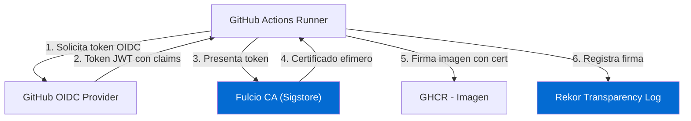

# Stage 5 — Escaneo de Imagen + Firma (Trivy + Cosign)

<div class="lab-meta">
  <div class="lab-meta-item">
    <strong>Herramientas</strong>
    Trivy Image + Cosign
  </div>
  <div class="lab-meta-item">
    <strong>Escaneo</strong>
    CVEs en imagen publicada
  </div>
  <div class="lab-meta-item">
    <strong>Firma</strong>
    Keyless via Sigstore OIDC
  </div>
</div>

---

## Que hace este stage

Primero, Trivy escanea la **imagen ya publicada** en GHCR buscando vulnerabilidades tanto en paquetes del SO (Alpine/Debian) como en librerias de la aplicacion. Despues, Cosign **firma la imagen sin necesidad de gestionar claves** usando la identidad OIDC de GitHub Actions. Esto crea una prueba criptografica de que la imagen fue construida por tu pipeline.

---

## YAML del Workflow

```yaml
image-scan:
  name: '5. Escaneo de Imagen + Firma'
  runs-on: ubuntu-latest
  needs: build
  steps:
    - name: Trivy -- Image Scan
      uses: aquasecurity/trivy-action@master
      with:
        image-ref: ${{ env.REGISTRY }}/${{ env.IMAGE_NAME }}:${{ env.IMAGE_TAG }}
        severity: CRITICAL,HIGH
        exit-code: "0"
        format: sarif
        output: trivy-image.sarif

    - name: Upload SARIF a GitHub Security
      uses: github/codeql-action/upload-sarif@v4
      if: always()
      with:
        sarif_file: trivy-image.sarif
        category: trivy-image

    - name: Instalar Cosign
      uses: sigstore/cosign-installer@v3

    - name: Login a GHCR (para firmar)
      uses: docker/login-action@v4
      with:
        registry: ${{ env.REGISTRY }}
        username: ${{ github.actor }}
        password: ${{ secrets.GITHUB_TOKEN }}

    - name: Cosign -- Firma de Imagen (keyless)
      run: |
        cosign sign --yes \
          ${{ env.REGISTRY }}/${{ env.IMAGE_NAME }}@${{ needs.build.outputs.image-digest }}

    - name: Registrar firma
      run: |
        echo "### Imagen firmada :lock:" >> $GITHUB_STEP_SUMMARY
        echo "- **Digest:** ${{ needs.build.outputs.image-digest }}" >> $GITHUB_STEP_SUMMARY
        echo "- **Metodo:** Cosign keyless (Sigstore)" >> $GITHUB_STEP_SUMMARY
```

---

## Resultados esperados del escaneo de imagen

!!! example "Salida tipica de Trivy Image"

    ```
    ghcr.io/<owner>/<repo>/devsecops-vulnerable-app:5 (python 3.11-slim)
    =====================================================================
    Total: 8 (HIGH: 6, CRITICAL: 2)

    OS Packages (debian 12)
    +-----------+------------------+----------+-------------------+---------------+
    |  LIBRARY  |       CVE        | SEVERITY | INSTALLED VERSION | FIXED VERSION |
    +-----------+------------------+----------+-------------------+---------------+
    | libexpat  | CVE-2024-45490   | CRITICAL | 2.5.0-1           | 2.5.0-1+deb12u1|
    | zlib      | CVE-2023-45853   | CRITICAL | 1.2.13-1          |               |
    | libssl3   | CVE-2024-0727    | HIGH     | 3.0.11-1          | 3.0.13-1      |
    +-----------+------------------+----------+-------------------+---------------+

    Python (requirements.txt)
    +----------------+---------+------------------+----------+
    |    LIBRARY     | VERSION |       CVE        | SEVERITY |
    +----------------+---------+------------------+----------+
    | Flask          | 3.0.0   | CVE-2023-30861   | HIGH     |
    | Werkzeug       | 3.0.0   | CVE-2023-46136   | HIGH     |
    | cryptography   | 41.0.7  | CVE-2024-26130   | CRITICAL |
    | requests       | 2.28.0  | CVE-2023-32681   | HIGH     |
    +----------------+---------+------------------+----------+
    ```

!!! note "Diferencia con el SCA (Stage 3)"

    El Stage 3 (SCA) escanea solo los archivos de dependencias en el repositorio. Este stage escanea la **imagen construida**, lo que ademas encuentra vulnerabilidades en paquetes del sistema operativo base (Debian/Alpine). Es un escaneo mas completo.

---

## Firma keyless con Cosign



!!! info "Que es la firma keyless"

    Con la firma **keyless** (sin claves), no necesitas generar, almacenar ni rotar claves criptograficas. En su lugar:

    1. GitHub Actions proporciona un **token OIDC** que identifica al workflow.
    2. **Fulcio** (la CA de Sigstore) emite un certificado efimero (valido ~10 min) vinculado a esa identidad.
    3. Cosign firma la imagen con ese certificado.
    4. La firma se registra en **Rekor**, un log de transparencia publico e inmutable.

    **Resultado**: cualquiera puede verificar que la imagen fue firmada por *tu* pipeline de GitHub Actions, sin que tu gestiones ninguna clave.

---

## Verificar la firma

Para verificar la firma desde cualquier maquina:

```bash
cosign verify \
  --certificate-identity-regexp="https://github.com/<owner>/<repo>/*" \
  --certificate-oidc-issuer="https://token.actions.githubusercontent.com" \
  ghcr.io/<owner>/<repo>/devsecops-vulnerable-app:5
```

!!! success "Salida esperada de la verificacion"

    ```
    Verification for ghcr.io/<owner>/<repo>/devsecops-vulnerable-app:5 --
    The following checks were performed on each of these signatures:
      - The cosign claims were validated
      - Existence of the claims in the transparency log was verified offline
      - The code-signing certificate was verified using trusted certificate authority

    [{"critical":{"identity":{"docker-reference":"ghcr.io/<owner>/<repo>/devsecops-vulnerable-app"},
    "image":{"docker-manifest-digest":"sha256:9f86d081884c7d659a2feaa0c55ad015..."},
    "type":"cosign container image signature"},
    "optional":{"Issuer":"https://token.actions.githubusercontent.com",
    "Subject":"https://github.com/<owner>/<repo>/.github/workflows/devsecops.yml@refs/heads/main"}}]
    ```

---

## Donde verificar en GitHub

!!! tip "Que veras en la interfaz"

    1. **Security** > **Code scanning alerts** > filtra por **Tool: trivy-image** para ver las CVEs de la imagen.
    2. **Actions** > click en el run > **Summary**: veras el bloque "Imagen firmada" con el digest y metodo de firma.
    3. En **Packages** > tu imagen, veras un icono de firma (badge de Sigstore) junto a los tags firmados.
    4. El **Job Summary** del stage 9 (Deploy a Produccion) muestra que la firma se **verifica** antes de desplegar, cerrando el ciclo de confianza.

---

[:material-arrow-left: Anterior: Build + Imagen](04-build.md){ .md-button }
[:material-arrow-right: Volver al indice](index.md){ .md-button .md-button--primary }
