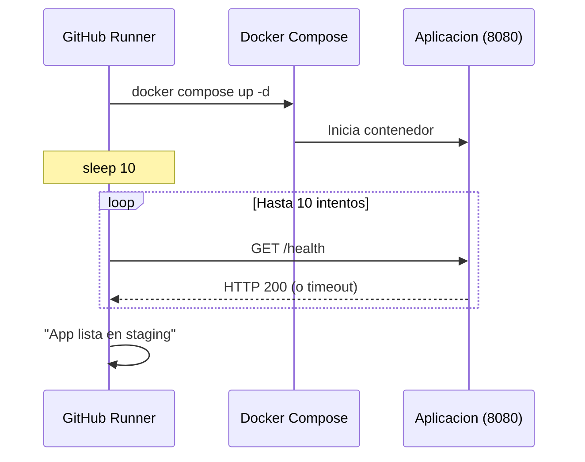

# Stage 7 — Deploy a Staging

<div class="lab-meta">
  <div class="lab-meta-item">
    <strong>Herramienta</strong>
    Docker Compose
  </div>
  <div class="lab-meta-item">
    <strong>Verificacion</strong>
    Health check loop en /health
  </div>
  <div class="lab-meta-item">
    <strong>Environment</strong>
    staging
  </div>
  <div class="lab-meta-item">
    <strong>Resultado esperado</strong>
    HTTP 200 OK
  </div>
</div>

---

## Que hace este stage

Este job construye y levanta la aplicacion usando `docker compose up -d` directamente en el runner de GitHub Actions. Luego ejecuta un **loop de health check** que intenta hasta 10 veces verificar que `/health` responde con HTTP 200. Esto simula un despliegue a un entorno de staging antes de ejecutar las pruebas DAST.

---

## Output esperado en el log

### Step: Deploy a Staging

```text
Desplegando a staging...
[+] Running 2/2
 ✔ Network vulnerable-app_default  Created
 ✔ Container vulnerable-app-web-1  Started
```

### Step: Verificar deploy staging

```text
Intento 1/10 — status: 000
Intento 2/10 — status: 000
App lista en staging
```

!!! success "Mensaje clave"
    El output **"App lista en staging"** confirma que la aplicacion respondio correctamente al health check. Los primeros intentos con status `000` son normales: la app necesita unos segundos para iniciar.

---

## Que sucede internamente



---

## Donde verificar en GitHub

!!! tip "Como comprobarlo"

    1. **Actions** > click en el run > job **7. Deploy a Staging**
    2. Expandir el step **"Verificar deploy staging"**
    3. Buscar el mensaje `App lista en staging` en los logs
    4. El job usa el **GitHub Environment** `staging` (visible en el badge del job)

---

## Posibles errores

!!! warning "Si el health check falla"
    Si ves `ERROR: App no respondio en staging` despues de 10 intentos, verifica:

    - Que el `Dockerfile` y `docker-compose.yml` existan en el repositorio
    - Que el puerto 8080 este correctamente mapeado
    - Que la app no tenga errores de inicio (revisar logs con `docker compose logs`)

---

<div style="display: flex; justify-content: space-between; margin-top: 2rem;">
  <a href="../06-iac/" class="md-button">:material-arrow-left: 6. IaC Scan</a>
  <a href="../08-dast/" class="md-button md-button--primary">8. DAST (ZAP) :material-arrow-right:</a>
</div>
