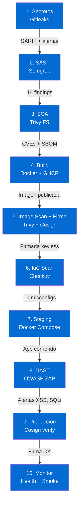

# Resultados del Pipeline

Cada stage del pipeline produce reportes, artefactos y hallazgos de seguridad.
Esta sección muestra los **resultados esperados** para que puedas verificar que
tu pipeline funcionó correctamente.

---

## Vista General

---

- :material-key-alert: **[1. Detección de Secretos](01-secretos.md)**

    Gitleaks encuentra credenciales en `.env.example` y `users.py`

- :material-shield-search: **[2. SAST — Semgrep](02-sast.md)**

    14 hallazgos: SQLi, XSS, MD5, debug mode, hardcoded secrets

- :material-package-variant-closed: **[3. SCA — Trivy FS](03-sca.md)**

    CVEs en dependencias + SBOM en formato CycloneDX

- :material-docker: **[4. Build + Imagen](04-build.md)**

    Imagen Docker publicada en GHCR con tags inmutables

- :material-certificate: **[5. Image Scan + Firma](05-image-scan.md)**

    Trivy escanea la imagen + Cosign firma keyless via Sigstore

- :material-terraform: **[6. IaC Scan](06-iac.md)**

    Checkov detecta 10 misconfigs en el Terraform inseguro

- :material-rocket-launch: **[7. Deploy Staging](07-staging.md)**

    App desplegada via Docker Compose, health check OK

- :material-web-check: **[8. DAST — OWASP ZAP](08-dast.md)**

    ZAP encuentra XSS, SQLi, cabeceras faltantes en la app en ejecución

- :material-shield-check: **[9. Deploy Producción](09-produccion.md)**

    Cosign verifica la firma antes de desplegar

- :material-chart-timeline-variant-shimmer: **[10. Monitorización](10-monitor.md)**

    Health checks, smoke tests y verificación de cabeceras

---

## Dónde Ver los Resultados

| Resultado | Dónde encontrarlo |
|---|---|
| Hallazgos de seguridad (SARIF) | **Security** → **Code scanning alerts** |
| Artefactos (reportes, SBOM) | **Actions** → click en el run → **Artifacts** |
| Imagen Docker | **Packages** (en la sidebar del repo) |
| Firma Cosign | `cosign verify` en la imagen publicada |
| Pipeline summary | **Actions** → click en el run → **Summary** |
